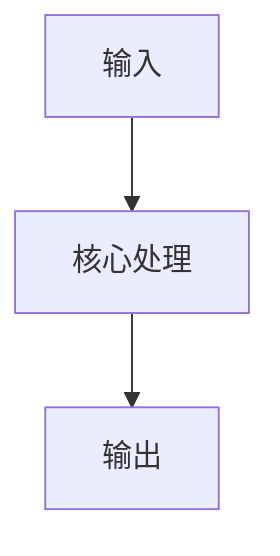
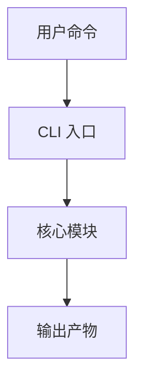

# 交互式项目学习

用课堂式节奏带用户学习一个代码项目：先建立心智模型，再逐层读入口、配置、核心模块、数据流、测试和扩展点。每节课只讲一个可消化主题，并把高价值内容沉淀为 lesson 文档。

## 目标

帮助用户真正掌握项目，而不是只得到一次性摘要。

交付物包括：

- 学习路线图：按章节说明先学什么、后学什么。
- 课堂讲解：图、代码地图、调用链、数据流、关键函数解释。
- 互动检查：每节提出少量问题，确认用户是否理解。
- lesson 文档：把图、关键结论、用户困惑和已确认理解写入文档。

## 适用场景

- 用户说“从小白角度理解项目”。
- 用户说“带着我读代码”。
- 用户说“交互式学习”。
- 用户说“把你讲的图/文字/总结写进 lesson/usebook”。
- 用户希望理解模块、函数调用、数据流、CLI 入口、配置、测试执行链路。

## 基本原则

1. **先建地图，再读代码**：不要一上来逐行解释。先说明系统边界、入口、主链路和目录职责。
2. **每节只讲一个主题**：一次只学一个模块或一条调用链，避免信息过载。
3. **以真实文件为准**：讲解必须指向实际代码、配置和文档，不凭记忆编造。
4. **从调用链解释函数**：解释函数时说清楚它被谁调用、输入是什么、输出给谁、失败如何处理。
5. **把抽象概念落到数据流**：优先画 `输入 -> 处理 -> 输出`。
6. **互动优先**：每节结束前问 1-3 个检查问题；用户回答后纠偏，再进入下一节。
7. **课堂笔记只记高价值内容**：不做聊天全文转录，只记录图、代码地图、关键结论、易错点和用户已确认的理解。
8. **不顺手改业务代码**：学习过程默认只读代码和写 lesson；除非用户明确要求，不修改项目实现。

## 文档位置

默认 lesson 目录按以下顺序选择：

1. 用户显式指定的 `$lesson_dir`。
2. 如果存在 `docs/usebook/lessons/`，使用它。
3. 如果存在 `docs/lessons/`，使用它。
4. 否则创建 `docs/lessons/`。

lesson 文件命名：

```text
lesson-1.md
lesson-2.md
lesson-3.md
...
```

如果已有 lesson，继续追加或创建下一节；不要覆盖用户已有笔记。

## 执行流程

### 第一步：建立学习路线

读取最小必要上下文：

- `README*`
- `AGENTS.md` / `CLAUDE.md` / 项目协作说明
- `pyproject.toml` / `package.json` / 主配置文件
- 顶层目录结构
- 主要入口文件

输出 5-10 节学习路线。每节应包含：

- 主题
- 要读的文件
- 要理解的问题
- 预期产出的 lesson 内容

不要在第一步就深入解释所有代码。

### 第二步：每节课的固定结构

每节课按这个顺序讲：

1. **学习目标**：本节要解决什么问题。
2. **一张图**：用 Mermaid 或 ASCII 画出调用链/数据流/模块关系。
3. **最小代码地图**：列出 3-8 个关键文件/函数及职责。
4. **关键路径讲解**：顺着真实调用链解释，不跳到无关模块。
5. **重要代码点**：解释关键函数、参数、返回值、错误处理和副作用。
6. **理解检查**：问用户 1-3 个问题。
7. **课堂笔记沉淀**：用户确认后，把图、表和关键结论写入 lesson。

### 第三步：课堂笔记格式

lesson 文档建议结构：

```markdown
# Lesson N：主题

> 学习目标：一句话说明本节目标。

## 调用图 / 数据流图



## 最小代码地图

| 文件/函数 | 职责 | 本节理解重点 |
|---|---|---|
| `path/to/file.py` | ... | ... |

## 关键理解

- ...
- ...

## 易错点

- ...

## 当前理解检查

- ...
```

如果用户指定“把第 2、4、5 点写进 lesson”，只写用户指定内容，避免扩写。

### 第四步：讲解深度控制

默认深度：

- 先解释模块职责和主调用链。
- 再解释关键函数。
- 最后解释关键行。

只有当用户明确要求“逐行解释”时，才做逐行解释。

解释代码时优先回答：

```text
这个函数为什么存在？
谁调用它？
它读什么输入？
它产生什么输出？
它改变了什么状态？
它失败时怎么表现？
它和上一层/下一层怎么连接？
```

### 第五步：互动规则

每节结束时优先问检查问题，例如：

- “这一步的输入和输出分别是什么？”
- “为什么这里要先保存 previous/current state？”
- “如果这个配置缺失，后面哪一步会失败？”
- “这段代码属于业务逻辑、框架逻辑，还是适配层？”

用户回答后：

- 回答正确：简短确认，并进入下一节或写 lesson。
- 回答不完整：指出缺口，补一小段解释。
- 用户说“不回答了/懂了”：不要强迫，直接进入下一节。

## 图的要求

优先使用 Mermaid：



图要服务理解，不要为了好看画大图。每张图控制在 5-12 个节点。

## 代码阅读纪律

- 搜索优先用 `rg` / `rg --files`。
- 先读入口和调用方，再读被调用函数。
- 不确定某函数是否被调用时，用 `rg "function_name"` 查证。
- 遇到配置项时，同时找 loader、schema/default、实际使用点。
- 遇到生成产物时，区分源文件和 generated/build output。
- 如果解释涉及当前版本行为，必要时运行最小命令验证。

## 输出风格

- 讲解要像课堂，不像审计报告。
- 保持短段落。
- 一次不要抛太多文件。
- 明确告诉用户“本节只需要记住什么”。
- 对初学者解释术语，但不要降低技术准确性。

## 完成标准

一次完整学习任务完成时，应至少有：

- 一份学习路线。
- 多个 lesson 文档。
- 每节包含图或代码地图。
- 用户能说明主调用链、关键模块职责、主要数据流和常见调试入口。
