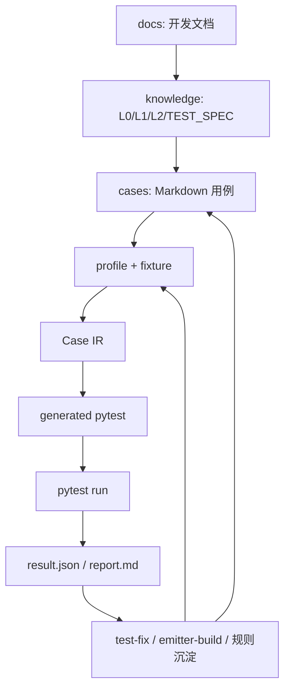

# Lesson 1：AITest Kit 的整体心智模型

> 学习目标：先理解 AITest Kit 不是“直接写 pytest 的工具”，而是一条测试资产生产线。后续阅读 `parser.py`、`planner.py`、`emitter.py` 时，都要把它们放回这条链路里理解。

## 测试资产生产线



这不是一次性流程，而是循环。

真正的价值在最后一段：

```text
失败 -> 分流 -> 修正 -> 沉淀 -> 下一轮更稳定
```

## AI 和代码的职责边界

我们这个项目的哲学可以压缩成一句话：

> AI 负责探索未知，代码负责稳定重复。

具体拆开：

AI 适合做：

- 读业务文档
- 理解新系统
- 设计初版用例
- 判断某类 pytest 是否值得沉淀
- 解释失败原因
- 少量补写暂时无法解析的断言

Python 代码必须做：

- 解析 Markdown
- 校验 profile 格式
- 检查 case_id 对齐
- 选择生成策略
- 生成 Case IR
- 渲染 pytest
- 执行 freshness check
- 收集 pytest 结果
- 生成报告

这也是为什么我们后来做了这么多“看起来重”的东西：

- `JSON Schema`：防止 profile 格式飘。
- `profile gate`：格式错误时不继续生成。
- `Case IR`：把“解析”和“生成”中间隔开，方便检查。
- `--dump-ir`：出问题时先看中间表示，而不是直接看最终 pytest。
- `--check`：确认 generated pytest 没过期。
- `report`：把执行结果结构化，方便反哺。
- `promotion` / `emitter-build`：把已验证的重复模式沉淀下来。

这些不是为了“去 AI 化”，而是为了让 AI 不必每次重新猜稳定规则。
