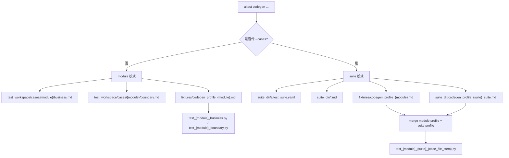

# Lesson 10：Codegen 当前版本更新地图

> 学习目标：重新理解当前版本的 codegen 组织方式，重点区分 module 模式、suite 模式、module profile、suite profile，以及近期新增的 profile variables 和运行前置条件能力。

## Codegen 双模式



## 关键理解

- `module profile` 放 L1 模块长期稳定能力，例如 fixture import、默认 client、通用 assertion rules。
- `suite profile` 跟用例批次走，放本批 L2 / 迭代用例的 `variables`、`case_flows`、`case_bodies`、`request_overrides`。
- suite 模式的 `case_files` 是显式白名单；如果真实 suite 有业务和边界两个文件，需要同时写入：

```yaml
module: gateway_api
suite: quota_billing_v2
case_files:
  - quota_billing_business.md
  - quota_billing_boundary.md
profile: codegen_profile_quota_billing_v2_suite.md
```

- suite generated pytest 文件名由 `module + suite + case_file_stem` 决定，例如：

```text
test_gateway_api_quota_billing_v2_quota_billing_business.py
test_gateway_api_quota_billing_v2_quota_billing_boundary.py
```

## Case Flow 默认值

`default_fixture`、`default_object`、`default_case_setup` 写在 profile YAML 顶层，不是代码硬编码。

```yaml
default_fixture: setup_gateway_api
default_object: client_factory
default_case_setup:
  call: client_factory
  kwargs:
    case_id: "{case_id}"
  save_as: client
```

含义：

| 字段 | 含义 |
|---|---|
| `default_fixture` | case_flow 未显式写 fixture 时使用的默认 pytest fixture |
| `default_object` | case_flow 未显式写 object 时使用的默认对象名 |
| `default_case_setup` | 自动插入到每条 case_flow 开头的初始化 step |

这样 suite profile 只需要写每条用例真正不同的动作，避免重复写 fixture/client 初始化逻辑。

## 待实现标记

当前 suite 模式已经支持：

```bash
aitest codegen --cases <dir> --validate-profile
aitest codegen --cases <dir> --dump-ir
aitest codegen --cases <dir> --check
aitest codegen --cases <dir> --dry-run
aitest codegen --cases <dir>
```

但还未支持以下三个 module 模式已有能力，后续可以补齐：

| 待实现项 | 作用 | 当前缺口 |
|---|---|---|
| `aitest codegen --cases <dir> --explain TC_ID` | 查看 suite 中单条 case 的 Case IR 和策略来源 | 需要按 `suite_dir + merged profile + TC_ID` 定位 case |
| `aitest codegen --cases <dir> --analyze-promotion` | 分析 suite profile 中 `case_bodies` 是否可晋升为 `case_flows` / helper / assertion rule | 当前 promotion 只分析 module profile |
| `aitest codegen --cases <dir> --health-report` | 输出 suite 级 codegen 健康度和成熟度 | 当前 health-report 是 module 级聚合 |

优先级建议：

1. 先做 `--explain`，因为它对调试 suite case 最直接。
2. 再做 `--health-report`，用于评估某个 L2/suite 的生成质量。
3. 最后做 `--analyze-promotion`，因为 promotion 需要更多人审和语义判断。

## Run/Report 待实现标记

当前 `aitest run <module>` 的 `_target_files()` 只按 module 模式查找：

```text
test_{module}_business.py
test_{module}_boundary.py
```

但 suite 模式会生成：

```text
test_{module}_{suite}_{case_file_stem}.py
```

因此 suite generated pytest 目前不能自然通过 `aitest run <module>` 精确选择。后续应补齐 suite 感知的 run/report 入口，例如：

```bash
aitest run --cases test_workspace/casesuites/quota_billing_v2
```

或等价机制，使 suite 执行也能复用：

- freshness check
- env 文件加载
- JUnit XML 收集
- `__tc_meta__` 合并
- failure classification
- `result.json` / `report.md`

## 本节结论

suite profile 的目的不是替代 module profile，而是让用例批次和 codegen 配置一起移动：

```text
模块稳定能力留在 module profile；
本批用例差异留在 suite profile；
新增 L2 需求时优先新增 suite，而不是继续膨胀 module profile。
```
