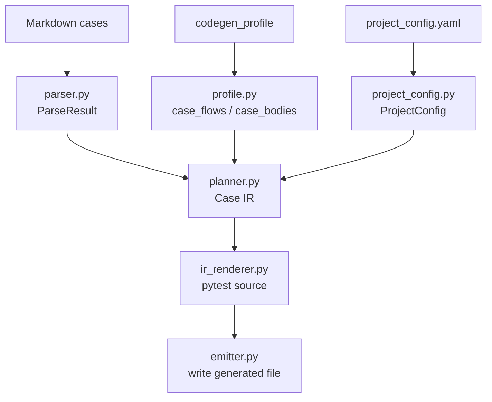

# Lesson 11：代码阅读路线和关键函数索引

> 学习目标：建立 `aitest-kit` 当前版本的源码阅读地图，知道从哪个入口读、按什么顺序读、哪些文件是主链路，避免在文件树中迷路。

## 总体心智模型

`aitest-kit` 的代码主干可以压缩成三条：

```text
1. workspace 管工作目录和模板
2. codegen 管 Markdown -> Case IR -> generated pytest
3. report 管 pytest -> result.json -> report.md
```

先把这三条读通，再看 health、promotion、doctor、模板和 tests。

## 最小代码地图

```text
aitest
  -> cli.py
     -> init_workspace.py
     -> upgrade_workspace.py
     -> doctor.py
     -> codegen/cli.py
        -> module_runner.py / suite_runner.py
        -> parser.py
        -> profile.py
        -> profile_validator.py
        -> planner.py
        -> case_flow_planner.py
        -> ir_renderer.py
        -> emitter.py
     -> report/cli.py
        -> runtime_variables.py
        -> collector.py
        -> classifier.py
        -> renderer.py
```

## 总入口

| 文件/函数 | 职责 | 本节理解重点 |
|---|---|---|
| `aitest_kit/cli.py` | 注册 `aitest` 子命令 | 只做命令分发，不放业务逻辑 |
| `main.add_command(codegen)` | 注册 codegen 命令 | 用户执行 `aitest codegen` 后进入 `codegen/cli.py` |
| `main.add_command(run_command)` | 注册 run 命令 | 用户执行 `aitest run` 后进入 `report/cli.py` |

`cli.py` 是路由层，不是业务层。读代码时不要在这里找 parser、profile、pytest 生成或报告逻辑。

## Workspace 相关阅读顺序

```text
aitest init
  -> init_workspace.py
  -> templates/project_workspace/

aitest upgrade
  -> upgrade_workspace.py

--workspace
  -> workspace.py
```

推荐顺序：

1. `workspace.py`：读 `push_workspace()`，理解为什么 `codegen/run/report` 可以临时切到指定 workspace 执行，并在结束后切回原目录。
2. `init_workspace.py`：读 `aitest init` 如何复制模板、创建 workspace manifest。
3. `upgrade_workspace.py`：读三方 hash 逻辑，理解为什么 upgrade 不会覆盖用户改过的文件。
4. `aitest_kit/templates/project_workspace/`：看新项目初始化出来的目录结构、默认配置和模板 skill。

这一组代码解决的是：

```text
AITest workspace 怎么创建、怎么升级、怎么避免覆盖用户资产。
```

## Codegen 主入口

先读 `aitest_kit/codegen/cli.py`。

关键路径：

```text
codegen()
  -> push_workspace(workspace)
  -> _codegen_impl(...)
```

`_codegen_impl()` 是 codegen 命令的模式分流层：

```text
--cases
  -> suite_runner.run_suite_codegen()

模块 / --all
  -> module_runner

--validate-profile
  -> validate_profiles()

--dump-ir
  -> dump_ir()

--check
  -> check_consistency()

普通生成
  -> generate_modules()
```

这里仍然不是最终生成逻辑。真正的解析、规划和渲染在 `parser.py`、`planner.py`、`ir_renderer.py` 和 `emitter.py`。

## Codegen 核心阅读顺序

按这个顺序读：

| 顺序 | 文件 | 你要读懂什么 |
|---|---|---|
| 1 | `codegen/parser.py` | Markdown 怎么变成 `ParseResult` 和 `TestCase` |
| 2 | `codegen/profile.py` | profile YAML 怎么加载出 `case_flows`、`case_bodies`、`variables` |
| 3 | `codegen/profile_validator.py` | `--validate-profile` 检查什么 |
| 4 | `codegen/project_config.py` | 项目默认路径、helper、断言规则、auto_fields |
| 5 | `codegen/planner.py` | `ParseResult + profile + config` 怎么变成 Case IR |
| 6 | `codegen/case_flow_planner.py` | case_flow step 怎么变成 IR |
| 7 | `codegen/ir_renderer.py` | Case IR 怎么渲染成 pytest 源码 |
| 8 | `codegen/emitter.py` | 如何写文件、检查语法、汇总生成结果 |
| 9 | `codegen/module_runner.py` | 模块模式怎么跑 |
| 10 | `codegen/suite_runner.py` | suite 模式怎么跑 |

阅读时每次问四个问题：

```text
这个函数的输入是什么？
输出给谁？
它有没有做业务判断？
它有没有写文件或改变外部状态？
```

## Codegen 数据流图



## Case IR 是中间枢纽

读 `aitest_kit/codegen/ir.py` 时，不需要一开始背所有字段，先抓住这些核心字段：

```text
CaseIR
  case_id
  strategy
  protocol
  fixtures
  request
  call
  assertions
  custom_body
  case_flow
  diagnostics
  source_trace
```

Case IR 的价值：

```text
parser 不直接生成 pytest。
planner 先生成 Case IR。
renderer 再把 Case IR 变成 pytest。
```

所以出问题时，先看：

```bash
aitest codegen <module> --dump-ir
```

不要第一时间盯 generated pytest。`--dump-ir` 能告诉你 strategy、fixture、request、call、assertion 到底来自哪里。

## Report 主链路

`aitest run` 的入口在 `aitest_kit/report/cli.py`。

执行顺序：

```text
1. 解析模块参数
2. 找 generated pytest 文件
3. 创建 run_id 和 run_dir
4. 加载 env file
5. 做 codegen freshness check
6. 调 pytest 子进程
7. 读取 junit.xml
8. collect_result()
9. 写 result.json
10. render report.md
```

相关文件：

| 文件 | 职责 |
|---|---|
| `report/cli.py` | `aitest run` / `aitest report` 入口 |
| `runtime_variables.py` | env file、profile variables、precondition 异常 |
| `report/collector.py` | JUnit XML + generated metadata -> result.json |
| `report/classifier.py` | 失败类型初判 |
| `report/renderer.py` | result.json -> report.md |
| `report/sanitizer.py` | 脱敏 |

## Runtime Variables

`runtime_variables.py` 解决两个问题：

```text
1. profile 里的 {var: xxx} 怎么取值
2. fixture 里 require_env() 缺变量时怎么抛结构化异常
```

心智模型：

```text
shell env 优先
.env / AITEST_ENV_FILE 次之
缺失 -> PreconditionMissing / ProfileVariableError
报告里显示变量名，不显示变量值
```

这层的目标不是“帮你准备测试数据”，而是让运行前置条件显式化，避免缺 env 被误判成普通断言失败或系统 bug。

## Doctor

`doctor.py` 是 workspace 体检，不是生成器。

它检查：

```text
workspace layout
project config
modules
fixture 注册
suite profile
profile gate
generated freshness
pytest collect
env info
```

读 `doctor.py` 的价值是理解：

```text
一个健康的 AITest workspace 应该具备哪些基本条件。
```

## 推荐通读顺序

第一轮：只读主干，不追所有 helper。

```text
cli.py
workspace.py
codegen/cli.py
codegen/module_runner.py
codegen/parser.py
codegen/planner.py
codegen/ir_renderer.py
report/cli.py
```

第二轮：补 profile 和变量。

```text
codegen/profile.py
codegen/profile_validator.py
codegen/profile_variables.py
runtime_variables.py
```

第三轮：补 suite。

```text
codegen/suite.py
codegen/suite_runner.py
```

第四轮：补报告。

```text
report/collector.py
report/classifier.py
report/renderer.py
report/sanitizer.py
```

第五轮：补维护能力。

```text
doctor.py
codegen/health.py
codegen/promotion.py
init_workspace.py
upgrade_workspace.py
```

## 不建议一开始读的内容

初学时不要先陷进这些：

```text
promotion.py
health.py
profile_schema.py
模板目录里的所有文件
所有 tests
所有 docs
```

它们不是不重要，而是主链路之外的增强能力。先把 `codegen` 和 `report` 主链路读通，再回来读这些文件。

## 具体练习任务

第一轮练习只做一件事：

```text
从 aitest codegen <module> 入口开始，
追踪到某一条 case_flow 最终怎么生成 pytest。
```

具体步骤：

1. 打开 `aitest_kit/codegen/cli.py`。
2. 找 `_codegen_impl()`。
3. 看普通模块如何进入 `generate_modules()`。
4. 跳到 `module_runner.py`，找 parse/profile/build/render/write 的调用链。
5. 跳到 `planner.py`，看 `build_file_ir()`。
6. 跳到 `case_flow_planner.py`，看 `build_case_flow_ir()`。
7. 跳到 `ir_renderer.py`，看 `_render_test_function()`。
8. 对照一份 `test_workspace/tests/generated/test_*.py`。

完成这条链后，就掌握了项目最核心的 60%。

## 本节结论

- `cli.py` 是总入口，只负责命令注册。
- `codegen/cli.py` 是 codegen 分流层，不是生成核心。
- `parser -> planner -> ir_renderer -> emitter` 是 Markdown 到 pytest 的核心链路。
- `Case IR` 是排查 codegen 问题时最重要的中间表示。
- `report/cli.py -> collector -> classifier -> renderer` 是执行报告链路。
- `runtime_variables.py` 把 env 和前置条件显式化。
- 初学者先读主链路，再读 health、promotion、doctor 和模板。
