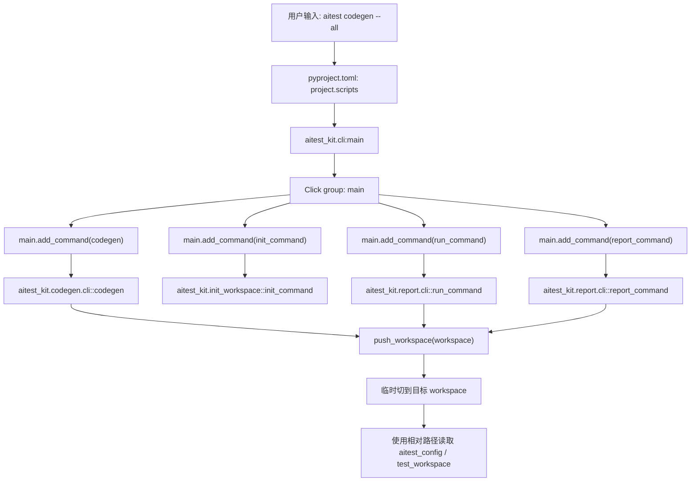

# Lesson 2：用户命令如何进入代码

> 学习目标：理解用户在终端输入 `aitest ...` 后，命令如何从 Python 包入口进入 `click`，再分发到 `init`、`codegen`、`run`、`report` 四条链路。

## CLI 调用图

## 最小代码地图

| 用户命令 | 顶层注册 | 实际入口 | 核心职责 |
|---|---|---|---|
| `aitest init` | `main.add_command(init_command)` | `init_workspace.py::init_command` | 初始化 workspace 模板 |
| `aitest codegen` | `main.add_command(codegen)` | `codegen/cli.py::codegen` | Markdown/profile 生成 pytest |
| `aitest run` | `main.add_command(run_command)` | `report/cli.py::run_command` | 跑 generated pytest 并生成报告 |
| `aitest report` | `main.add_command(report_command)` | `report/cli.py::report_command` | 从 result.json 重渲染 report.md |

## 当前理解检查

第二节的关键理解：

- `pyproject.toml` 里的 `aitest = "aitest_kit.cli:main"` 让用户执行 `aitest` 时直接进入 `cli.py::main`。
- `aitest_kit/cli.py` 只做命令注册和分发，保持顶层 CLI 简洁，不承载具体业务逻辑。
- `push_workspace()` 先保存 `previous = Path.cwd()`，是为了执行完命令后能切回原目录。
- `push_workspace()` 让命令执行期间处在同一个目标 workspace 下，所以内部可以稳定使用 `test_workspace/cases`、`aitest_config/config.yaml` 这样的相对路径。
- `aitest init` 不需要 `push_workspace()`，因为它不是在已有 workspace 中读取相对路径，而是向 `--target` 指定的新路径写入模板文件。
