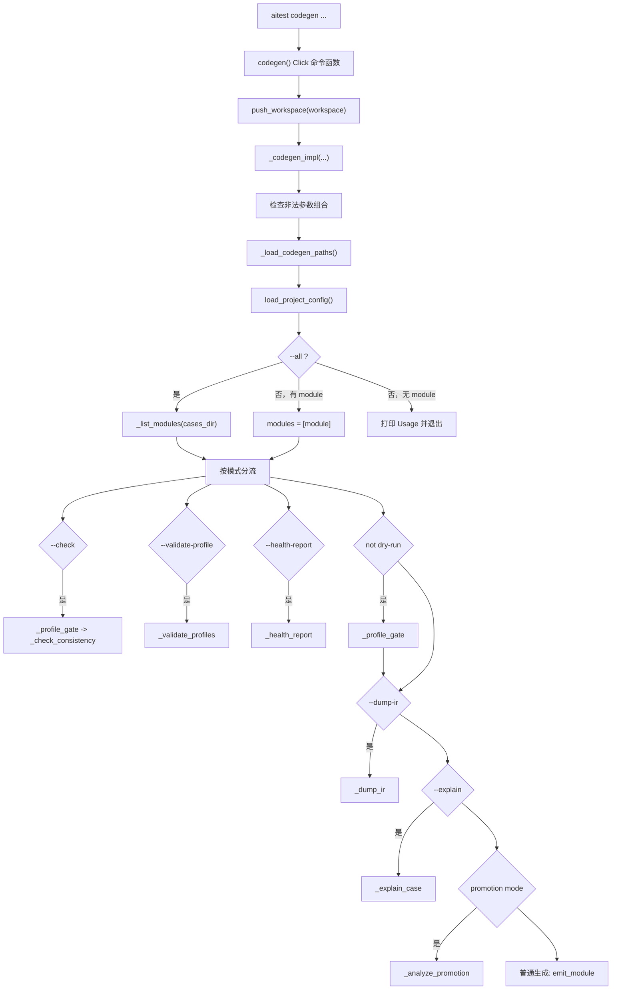

# Lesson 3：codegen CLI 外壳与模式分流

> 学习目标：理解 `aitest codegen ...` 先做命令参数判断、workspace 切换、路径加载、模块范围确认和模式分流；真正的 pytest 生成由后续 `emit_module()` 负责。

## codegen 按模式分流

确定 `modules` 后，`_codegen_impl()` 开始按模式分流。

### `--check`

```python
if check:
    gate_result = _profile_gate(modules, paths)
    if gate_result:
        sys.exit(gate_result)
    sys.exit(_check_consistency(...))
```

含义：

```text
先跑 profile gate。
如果 profile 有 ERROR，直接退出。
否则重新生成到临时目录，和当前 generated 文件比较。
```

这就是 `aitest codegen --all --check` 能发现 generated pytest 过期的原因。

### `--validate-profile`

```python
if validate_profile:
    sys.exit(_validate_profiles(...))
```

只验证 profile，不生成 pytest。

### `--health-report`

```python
if health_report:
    sys.exit(_health_report(...))
```

输出模块健康度和成熟度。

### 普通生成前的 profile gate

```python
if not dry_run:
    gate_result = _profile_gate(modules, paths)
    if gate_result:
        sys.exit(gate_result)
```

这是硬门禁：

```text
只要不是 dry-run，都必须先过 profile gate。
```

所以这些命令都会先检查 profile：

```bash
aitest codegen discount_policy
aitest codegen discount_policy --check
aitest codegen discount_policy --dump-ir
```

但这个命令不会：

```bash
aitest codegen discount_policy --dry-run
```

### `--dump-ir`

```python
if dump_ir:
    sys.exit(_dump_ir(modules, paths))
```

输出 Case IR JSON。

### `--explain`

```python
if explain:
    ...
    sys.exit(_explain_case(module, explain, paths))
```

输出单条 case 的 IR 解释。

### promotion 模式

```python
if promotion_mode:
    sys.exit(_analyze_promotion(...))
```

分析 `case_bodies` 是否可晋升。

### 普通生成

如果前面的模式都没有退出，就进入普通生成：

```python
for mod in modules:
    ...
    results = emit_module(...)
```

这里才真正生成 pytest。

## dry-run 是例外

最容易忽略的是：

```python
if not dry_run:
    gate_result = _profile_gate(modules, paths)
```

含义：

```text
普通生成、check、dump-ir、explain、promotion 都会被 profile gate 约束。
dry-run 不会。
```

原因是 `dry-run` 的定位是：

```text
只检查 Markdown parser 能不能解析。
```

它不应该要求 profile 已经写好。

这对新项目早期很重要：可能先有 Markdown 用例，还没来得及写 profile。

所以：

```bash
aitest codegen discount_policy --dry-run
```

可以作为更早期的检查。

而正式生成链路：

```bash
aitest codegen discount_policy
```

必须 profile 正确。

## 普通生成阶段

普通生成阶段逐个模块处理：

```python
for mod in modules:
    mod_dir = paths.cases_dir / mod
    if not mod_dir.exists():
        click.echo(f"[SKIP] {mod}: directory not found at {mod_dir}")
        continue
```

如果模块目录不存在，就跳过。

如果是 dry-run：

```python
if dry_run:
    ...
    result = parse_case_file(path)
    ...
    continue
```

只解析 Markdown，统计：

```text
Auto
Manual
Skipped
Errors
```

不生成文件。

如果不是 dry-run：

```python
results = emit_module(
    mod,
    cases_dir=paths.cases_dir,
    output_dir=paths.generated_dir,
    profile_dir=paths.profile_dir,
    project=project,
)
```

这里进入真正的 emitter。

也就是说：

```text
codegen/cli.py 不负责生成 pytest 内容。
它把模块名、路径、project_config 交给 emit_module()。
```

## codegen CLI 流程图



## codegen CLI 心智模型

`aitest codegen` 可以理解成一个路由器：

```text
先确定在哪个 workspace 运行
再加载路径配置
再确定模块范围
再判断用户要执行哪种模式
最后调用对应子系统
```

它本身不直接做重活。

重活分别交给：

| 子系统 | 职责 |
|---|---|
| `profile_validator.py` | `validate-profile` / profile gate |
| `health.py` | `health-report` |
| `promotion.py` | promotion analysis |
| `parser.py` | dry-run / IR 构建时解析 Markdown |
| `planner.py` | 生成 Case IR |
| `emitter.py` | 生成 pytest 文件 |

## debug 时先判断问题层级

| 问题现象 | 优先看哪里 |
|---|---|
| 命令参数组合报错 | `codegen/cli.py::_codegen_impl` 前半段 |
| `--all` 找不到模块 | `_list_modules()` 和 `test_workspace/cases/` |
| 路径不对 | `_load_codegen_paths()` 和 `aitest_config/config.yaml` |
| profile gate blocked | `profile_validator.py` |
| `--check` stale | `_check_consistency()` 和 emitter 输出 diff |
| pytest 生成内容不对 | `emit_module()` 之后的 parser/planner/renderer |
| `--dump-ir` 不符合预期 | `_build_module_ir()`、parser、planner |
