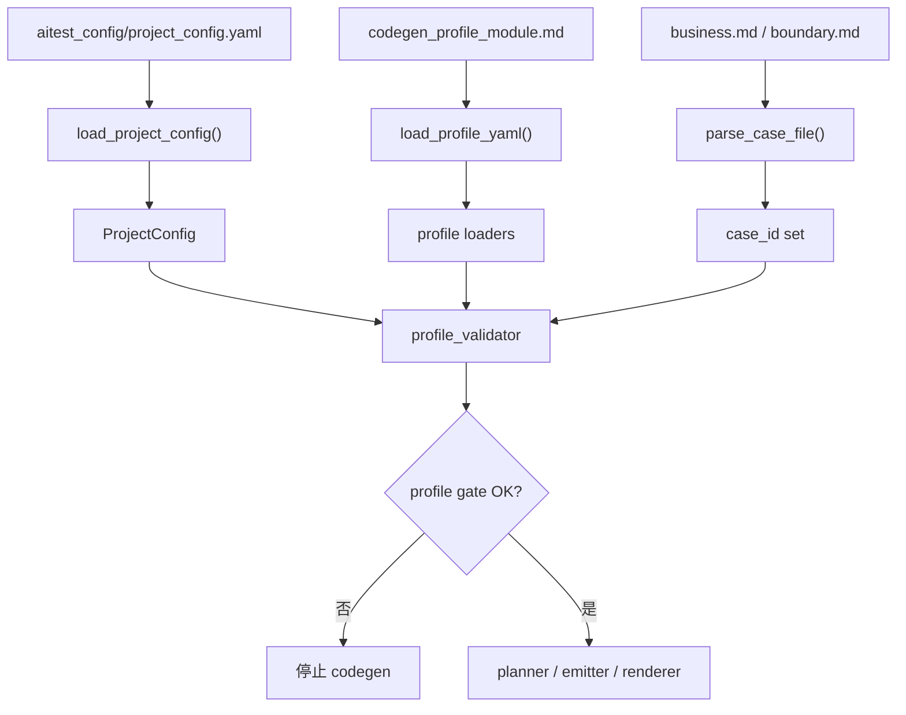

# Lesson 5：project_config 与 profile

> 学习目标：理解 `project_config.yaml` 和 `codegen_profile_{module}.md` 的分工。前者是项目级默认规则，后者是模块级补充规则；二者都必须先通过 profile gate，才能进入 IR 和 emitter。

## 核心分工

```text
project_config.yaml = 项目级默认规则
codegen_profile_xxx.md = 模块级补充规则
```

换句话说：

- `project_config.yaml` 回答：“这个项目整体怎么生成测试？”
- `codegen_profile_calibration.md` 回答：“calibration 这个模块有哪些特殊规则？”
- `codegen_profile_discount_policy.md` 回答：“discount_policy 这个模块有哪些特殊流程？”

它们不是一类东西。`project_config` 是全局地基，`profile` 是模块局部配置。

## profile_validator 是硬门禁

入口函数：

```python
def validate_profile_module(...)
```

它的执行顺序可以理解为：

```text
1. 找 Markdown 用例
2. parser 解析 Markdown，收集 case_id
3. 找 profile 文件
4. 严格读取 profile YAML
5. JSON Schema 校验
6. 顶层字段校验
7. case_bodies / case_flows 冲突校验
8. case_flow 结构校验
9. profile 中引用的 case_id 是否真的存在
10. module_type 是否满足 project_config 的要求
```

这里有一个重要边界：

```text
profile.py 是宽松 loader，读不到时倾向返回空结构；
profile_validator.py 是硬门禁，格式错误必须明确报错。
```

这是合理的分工：

- 真正生成时，loader 尽量不给调用方炸异常。
- 门禁阶段，validator 必须把格式问题明确拦住。

例如，profile 里写了：

```yaml
case_flows:
  TC-DP-001:
```

validator 会检查 `TC-DP-001` 是否真的存在于 Markdown 用例中。如果 Markdown 里没有这个 case_id，就报错：

```text
case id does not exist in module markdown cases
```

这一步防止 profile 和 Markdown 漂移。

## case_flow 的格式为什么严格

`case_flow` 是我们把复杂流程从“手写 pytest”沉淀成“结构化流程”的关键格式。它通常长这样：

```yaml
TC-DP-001:
  fixture: setup_discount_policy
  object: client
  steps:
    - call: client.health
      save_as: resp
    - assert: 'assert resp["status"] == "ok"'
```

它的校验规则包括：

| 规则 | 目的 |
|---|---|
| case_id 必须符合 `^TC-[A-Z0-9]+-\d+$` | 防止 profile key 写飘 |
| `fixture` 必须是非空字符串 | 确保测试函数能拿到前置对象 |
| `object` 如果存在，必须是 Python identifier | 确保生成代码里的变量名合法 |
| `steps` 必须是非空 list | 确保流程有真实执行内容 |
| 每个 step 只能是 `call` / `assert` / `assign` / `comment` 四选一 | 防止一个 step 同时表达多个动作，导致生成歧义 |
| `assert` 必须以 `assert ` 开头 | 保证断言进入 generated pytest 后就是明确 Python 断言 |
| `save_as`、`assign` 必须是合法 Python 变量名 | 防止生成语法错误 |
| `{ref: xxx}` 必须引用前面已经 `save_as` 的变量 | 防止运行时找不到变量 |

这就是“代码负责稳定重复”的体现：

```text
AI 可以生成 case_flow；
但 case_flow 一旦格式不对，代码门禁必须拦住；
不能让错误进入 emitter，生成一个看似成功但实际不可维护的 pytest。
```

## 配置流转图



一句话版：

```text
project_config 提供项目默认规则；
profile 提供模块特例；
profile_validator 把 Markdown、profile、project_config 三者对齐；
对齐后才允许进入 IR 和 emitter。
```

## 两个容易混淆的判断

### 为什么不主要编辑 project_config.py

`project_config.py` 是加载器和默认兜底，不是项目迁移时的主要编辑点。

新项目迁移时，真正需要变的是项目规则，例如默认 API path、helper import、模块注册、模块类型、断言规则。这些应该写进：

```text
aitest_config/project_config.yaml
```

而不是直接改：

```text
aitest_kit/codegen/project_config.py
```

更准确地说：

```text
配置会随项目变化；
loader 代码不应该随项目变化。
```

### 为什么 multi_endpoint 没有 case_bodies 或 case_flows 要拦住

`multi_endpoint` 表示这个模块不是默认“单接口推荐请求”模型。

如果它没有 `case_bodies` 或 `case_flows`，codegen 只能退回默认生成路径，而默认路径通常只知道：

```text
构造一个基础请求体
调用一个默认 API path
按默认断言规则生成 assert
```

这对多端点模块不够。多端点模块往往需要：

- 先调用 A 接口创建状态
- 再调用 B 接口查询状态
- 再调用 C 接口删除或清理状态
- 对多个响应分别断言

所以，没有 `case_bodies` 或 `case_flows` 时继续生成，很容易生成出“语法上能跑、语义上错误”的测试。

因此应在 profile gate 阶段直接拦住。

