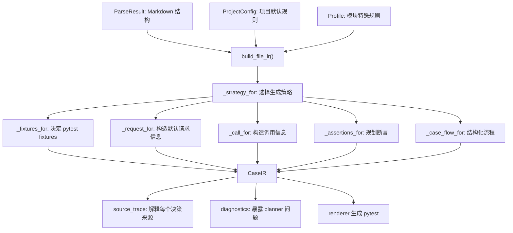

# Lesson 6：Case IR 与 planner

> 学习目标：理解 `planner.py` 如何把 parser 输出、project_config 和 profile 合并成 Case IR。planner 不生成 pytest，它生成“可检查、可解释的生成计划”。

## Case IR 的数据结构

`FileIR` 表示一个 Markdown 文件对应的生成计划：

```python
@dataclass
class FileIR:
    module: str
    category: str
    source_file: str
    diagnostics: list[DiagnosticIR] = field(default_factory=list)
    cases: list[CaseIR] = field(default_factory=list)
```

`CaseIR` 表示一条用例的生成计划：

```python
@dataclass
class CaseIR:
    case_id: str
    title: str
    module: str
    category: str
    source_file: str
    section: str
    priority: str
    markers: list[str]
    strategy: str
    protocol: str
    skip_reason: str | None = None
    fixtures: list[str] = field(default_factory=list)
    setup_call: SetupCallIR | None = None
    request: RequestIR | None = None
    call: CallIR | None = None
    variables: list[VariableIR] = field(default_factory=list)
    assertions: list[AssertionIR] = field(default_factory=list)
    custom_body: CustomBodyIR | None = None
    case_flow: CaseFlowIR | None = None
    diagnostics: list[DiagnosticIR] = field(default_factory=list)
    source_trace: dict[str, SourceTraceIR] = field(default_factory=dict)
```

最重要的字段：

| 字段 | 含义 |
|---|---|
| `strategy` | 生成策略，如 `default_http`、`structured_case_flow`、`custom_case_body` |
| `protocol` | 协议类型，如 `http`、`grpc`、`flow`、`custom` |
| `fixtures` | pytest 测试函数需要的 fixture |
| `request` | 默认请求体生成计划 |
| `call` | 默认请求调用计划 |
| `variables` | 从响应中提取的变量，例如 `s`、`cal` |
| `assertions` | Markdown 断言的规划结果 |
| `case_flow` | 结构化流程步骤 |
| `custom_body` | 手写 pytest body |
| `diagnostics` | planner 层发现的问题 |
| `source_trace` | 每个关键决策来自哪里 |

## planner 入口先加载 profile

入口函数：

```python
def build_file_ir(
    parse_result: ParseResult,
    category: str,
    profile_path: str | Path | None = None,
    project: ProjectConfig | None = None,
) -> FileIR:
```

planner 开始规划前，会读取模块 profile 中的几类信息：

```python
proj = project or DEFAULT_PROJECT
profile_rules = load_profile_rules(profile_path) if profile_path else []
request_overrides = load_profile_request_overrides(profile_path) if profile_path else {}
case_fixtures = load_profile_case_fixtures(profile_path) if profile_path else {}
case_bodies = load_profile_case_bodies(profile_path) if profile_path else {}
case_flows = load_profile_case_flows(profile_path) if profile_path else {}
```

这些字段的用途：

| profile 字段 | planner 用途 |
|---|---|
| `assertion_rules` | 模块级断言翻译规则 |
| `request_overrides` | 默认请求体的 case 级覆盖 |
| `case_fixtures` | 某条用例的 fixture 签名 |
| `case_bodies` | 某条用例完全手写 body |
| `case_flows` | 某条用例结构化流程 |

这里是三类信息第一次合流：

```text
Markdown parser output
+ project_config
+ codegen_profile
```

## 策略选择：_strategy_for

`_strategy_for()` 决定一条用例走哪条生成路线。

当前优先级：

```text
skipped
  > custom_case_body
  > structured_case_flow
  > manual
  > default_grpc
  > default_http
```

对应逻辑：

```python
reason = _skip_reason(tc)
if reason:
    return "skipped", "markers", reason

if tc.id in case_bodies:
    return "custom_case_body", f"profile.case_bodies.{tc.id}", "profile provides custom body"

if tc.id in case_flows:
    return "structured_case_flow", f"profile.case_flows.{tc.id}", "profile provides structured flow"

if _has_marker(tc, "manual"):
    return "manual", "markers", "manual marker"

is_grpc, source, raw = _grpc_source(tc)
if is_grpc:
    return "default_grpc", source, raw

return "default_http", "default", "no custom strategy or gRPC marker"
```

这意味着：

- `可行性存疑` 优先级最高，直接 `skipped`。
- `case_bodies` 比 `case_flows` 优先级更高，但 profile gate 会禁止同一条 case 同时出现在二者中。
- `case_flows` 表示这条用例已经有结构化流程，不需要默认请求生成。
- `manual` 表示生成人工检查注释，不走自动断言。
- gRPC 标记只影响没有 profile 特殊策略的默认用例。
- 以上都没有时，才走 `default_http`。

## fixtures 怎么决定

`_fixtures_for()` 决定 generated pytest 测试函数签名里需要哪些 fixture。

规则：

| strategy/protocol | fixtures |
|---|---|
| `skipped` | `[]` |
| `custom_case_body` | profile 的 `case_fixtures`，没有则默认 `setup_{module}` |
| `structured_case_flow` | `case_flows.{case_id}.fixture` |
| `default_grpc` | `grpc_target` + `setup_{module}` |
| `default_http` | `http_base_url` + `setup_{module}` |

例如 `calibration` 默认 HTTP 用例：

```json
"fixtures": ["http_base_url", "setup_calibration"]
```

例如 `ab_service` 的 case_flow：

```json
"fixtures": ["setup_ab_service"]
```

## request 怎么决定

`_request_for()` 只给默认策略生成请求计划。

这三类策略不生成 request：

```python
if strategy in {"skipped", "custom_case_body", "structured_case_flow"}:
    return None
```

原因：

- `skipped` 不生成测试函数。
- `custom_case_body` 自己写完整 pytest body。
- `structured_case_flow` 自己描述调用步骤。

默认请求 ID 生成逻辑：

```python
abbrev = module_abbrev(module, project)
num = tc_number(tc.id)
default_user_id = f"u_{abbrev}_{num}"
default_req_id = f"req_{abbrev}_{num}"
```

例如：

```text
module = calibration
tc.id = TC-CAL-001
module_abbrev = cal
num = 001
```

生成：

```text
user_id = u_cal_001
req_id = req_cal_001
```

然后再读取 profile 的 `request_overrides`：

```python
configured = dict(request_overrides.get(tc.id, {}))
user_id = configured.pop("user_id", default_user_id)
req_id = configured.pop("reqId", configured.pop("req_id", default_req_id))
```

如果 profile 没写 `request_overrides`，就完全使用默认值。

当前 `calibration` profile 没有 `request_overrides`，所以校准模块主要走默认 ID 生成规则。另一个模块 `ab_experiment` 有真实例子：

```yaml
request_overrides:
  TC-AB-001:
    user_id: u_ab_hash_http
    reqId: req-ab-001
    scene_name: game
    device: mobile
    external: 0
```

这会覆盖默认的 `user_id`、`reqId`，其余字段进入 `RequestIR.overrides`。

## call 怎么决定

`_call_for()` 决定默认请求用哪个 helper、打哪个目标、走哪个 API path。

```python
if strategy in {"skipped", "custom_case_body", "structured_case_flow"}:
    return None
if protocol == "grpc":
    return CallIR(helper=project.grpc_helper_call, target="grpc_target")
return CallIR(
    helper=project.helper_call,
    target="http_base_url",
    api_path=project.api_path,
)
```

默认 HTTP 用 `project_config.yaml` 里的：

```yaml
helper_call: "http_helper.post"
api_path: "/api/v1/recommend"
```

所以 IR 里会出现：

```json
"call": {
  "helper": "http_helper.post",
  "target": "http_base_url",
  "api_path": "/api/v1/recommend"
}
```

## 变量怎么决定

`_needed_variables()` 会扫描断言里出现了哪些变量。

例如断言：

```text
cal == round(clamp(1.2 * s + 0.1), 4)
```

planner 发现使用了：

```text
s
cal
```

然后用 `project_config.var_map` 找到真实 Python 表达式：

```yaml
var_map:
  s: 'resp["results"][0]["score"]'
  cal: 'resp["results"][0]["calibrated_score"]'
```

最终生成 `VariableIR`：

```json
"variables": [
  {
    "name": "s",
    "expression": "resp[\"results\"][0][\"score\"]",
    "source": "project_config.var_map"
  },
  {
    "name": "cal",
    "expression": "resp[\"results\"][0][\"calibrated_score\"]",
    "source": "project_config.var_map"
  }
]
```

这条链路是：

```text
Markdown 断言出现 s/cal
  -> planner 判断需要变量
  -> project_config.var_map 找表达式
  -> IR 记录 VariableIR
  -> renderer 生成 Python 变量赋值
```

## 断言怎么决定

`_assertions_for()` 会按策略处理断言。

如果是 `custom_case_body`：

```text
断言已经包含在手写 body 里；
CaseIR.assertions 只记录 resolved_by=profile.case_bodies.{case_id}
```

如果是 `structured_case_flow`：

```text
Markdown 断言只作为来源记录；
真正可执行 assert 在 case_flow.steps 里。
```

如果是 `manual`：

```text
生成 MANUAL CHECK 注释，不做自动断言。
```

如果是默认 HTTP/gRPC：

```text
先处理 common_assertions；
再处理当前 case 的 assertions；
每条调用 resolve_assertion() 转成 Python assert。
```

`resolve_assertion()` 的匹配顺序是：

```text
profile assertion_rules
  -> project_config builtin_assertion_rules
  -> project_config named_templates
  -> UNPARSED
```

所以模块特殊断言优先于项目通用断言。

## case_flow 怎么变成 IR

`_case_flow_for()` 会把 profile YAML 中的 `steps` 转成 `CaseFlowStepIR`。

profile 示例：

```yaml
steps:
  - call: client.health
    save_as: resp
  - assert: 'assert resp["status"] == "ok"'
```

转成 IR：

```json
"case_flow": {
  "source": "profile.case_flows.TC-DP-001",
  "fixture": "setup_discount_policy",
  "object_name": "client",
  "steps": [
    {
      "kind": "call",
      "call": "client.health",
      "save_as": "resp"
    },
    {
      "kind": "assert",
      "assertion": {
        "kind": "raw_python",
        "code_lines": ["assert resp[\"status\"] == \"ok\""]
      }
    }
  ]
}
```

`case_flow` 支持四种 step：

| step | 含义 | 典型用途 |
|---|---|---|
| `call` | 调用一个函数或方法 | `client.evaluate(...)`、`ab.post(...)`、`issue.request(...)` |
| `assert` | 写一条断言 | `assert resp["code"] == 0` |
| `assign` | 给变量赋值 | `query_resp = query_http.json()` |
| `comment` | 生成注释 | 保留解释性步骤，不影响运行 |

`call` 可配合：

| 字段 | 含义 |
|---|---|
| `args` | 位置参数 |
| `kwargs` | 关键字参数 |
| `save_as` | 把返回值保存为变量，供后续步骤使用 |

`assign` 可配合：

| 字段 | 含义 |
|---|---|
| `assign` | 目标变量名 |
| `expr` | Python 表达式 |

`assert` 目前要求明确写成 Python 断言：

```yaml
- assert: 'assert resp["status"] == "ok"'
```

这能覆盖大量确定性测试流程：

- 多接口顺序调用
- 创建后查询
- 删除后查询
- 保存中间响应
- 从响应中取 JSON
- 对多个响应分别断言
- 调 fixture/client/helper 方法

但它不是完整 Python 语言替代品。复杂控制流仍可能需要 `case_bodies`，例如：

- `for` 循环
- `try/finally`
- `with` 上下文管理
- 复杂异常捕获
- 子进程生命周期控制
- 临时文件/目录复杂编排
- 多线程/并发测试

经验判断：

```text
线性步骤 + 中间变量 + 明确断言 -> case_flow
复杂控制流 / 生命周期 / 并发 -> case_body
```

## planner 总图



最短版：

```text
planner 的职责不是生成 pytest，而是为 renderer 准备一份明确、可检查、可解释的生成计划。
```

