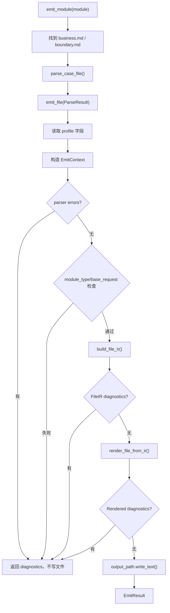
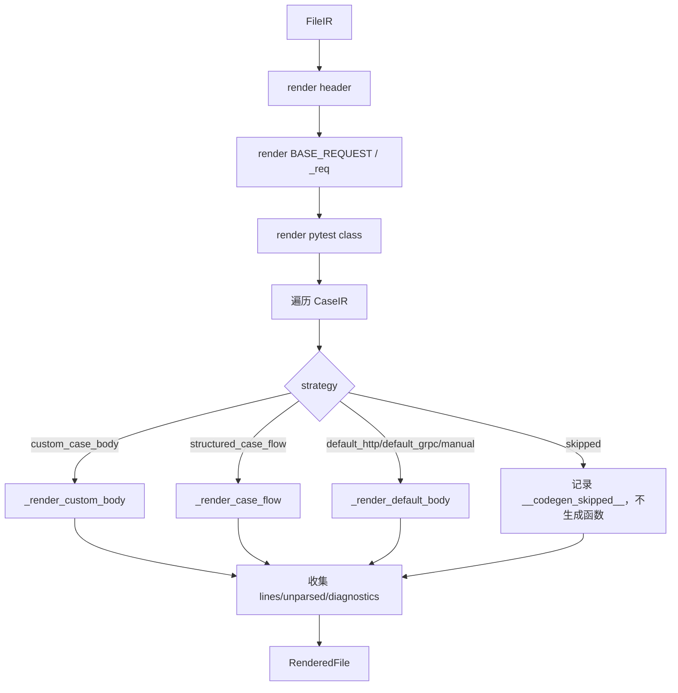

# Lesson 7：emitter 与 renderer

> 学习目标：理解 `emitter.py` 和 `ir_renderer.py` 的分工。emitter 负责编排、诊断和落盘；renderer 负责把 Case IR 打印成 pytest 源码。

## emitter 的入口

核心入口：

```python
emit_module(...)
emit_file(...)
```

`emit_module()` 是模块级入口：

```python
def emit_module(
    module: str,
    cases_dir: str | Path = "test_workspace/cases",
    output_dir: str | Path = "test_workspace/tests/generated",
    profile_dir: str | Path = "test_workspace/tests/fixtures",
    project: ProjectConfig | None = None,
) -> list[EmitResult]:
```

它做的事情：

```text
1. 找 profile：test_workspace/tests/fixtures/codegen_profile_{module}.md
2. 遍历 business.md / boundary.md
3. 每个 Markdown 文件调用 parse_case_file()
4. 每个 ParseResult 调用 emit_file()
```

所以命令：

```bash
python3 -m aitest_kit.cli codegen calibration
```

主链路是：

```text
cli.codegen
  -> emit_module("calibration")
  -> parse business.md
  -> emit_file(business)
  -> parse boundary.md
  -> emit_file(boundary)
```

## emit_file 的执行顺序

`emit_file()` 是真正的单文件生成入口。

核心步骤：

```text
1. 确定输出路径
2. 读取 profile 字段
3. 构造 EmitContext
4. 如果 parser 有错误，停止
5. 检查 module_type 要求
6. 检查默认路径是否有基础请求体
7. 调 planner 生成 FileIR
8. 如果 IR 有 diagnostics，停止
9. 调 renderer 渲染 pytest
10. 如果 renderer 有 diagnostics，停止
11. 写入 generated 文件
12. 返回 EmitResult
```

关键逻辑：

```python
file_ir = build_file_ir(...)
rendered = render_file_from_ir(file_ir, parse_result.cases, ctx)
output_path.write_text("\n".join(rendered.lines), encoding="utf-8")
```

这说明 emitter 本身不直接拼测试函数。它只负责把 parser、planner、renderer 串起来。

## EmitResult 是什么

```python
@dataclass
class EmitResult:
    output_path: str
    case_count: int
    skipped: list[tuple[str, str]]
    unparsed: list[tuple[str, str]]
    manual_count: int
    diagnostics: list[str] = field(default_factory=list)
```

它是 emitter 对 CLI 的汇报结果。

CLI 最后打印的：

```text
Cases
Manual
Skipped
Unparsed
Diagnostics
```

都来自 `EmitResult`。

## renderer 的入口

入口函数：

```python
def render_file_from_ir(
    file_ir: FileIR,
    test_cases: list[TestCase],
    ctx: EmitContext,
) -> RenderedFile:
```

输入：

```text
file_ir：planner 生成的中间计划
test_cases：parser 原始 case 元数据
ctx：emitter 准备的上下文
```

输出：

```python
@dataclass
class RenderedFile:
    lines: list[str]
    case_count: int
    skipped: list[tuple[str, str]]
    unparsed: list[tuple[str, str]]
    manual_count: int
    diagnostics: list[str] = field(default_factory=list)
```

`RenderedFile.lines` 就是最终 pytest 文件的每一行。

所以 renderer 的本质是：

```text
CaseIR -> list[str]
```

## renderer 先渲染文件头

`_render_header()` 生成：

```python
# Auto-generated from ...
# DO NOT EDIT — regenerate with: /test-codegen ...
import pytest
from test_workspace.tests.helpers import http as http_helper
```

这里的 helper import 来自：

```python
ctx.project.helper_import
```

也就是 `project_config.yaml`。

如果文件里有 gRPC case，会追加：

```python
ctx.project.grpc_helper_import
```

如果 profile 里有 `extra_imports`，也会追加。

## 默认请求模板怎么渲染

默认 HTTP 路径会渲染 `BASE_REQUEST` 和 `_req()`。

当前实现会把共享基础请求体里的身份字段清空：

```python
sanitized = dict(body)
sanitized["user_id"] = None
sanitized["reqId"] = None
```

然后生成：

```python
BASE_REQUEST = {...}
```

再生成：

```python
def _req(user_id: str, req_id: str, **overrides) -> dict:
    body = {**BASE_REQUEST, "user_id": user_id, "reqId": req_id}
    body.update(overrides)
    return body
```

这意味着默认 HTTP 路径当前假设请求体里有：

```text
user_id
reqId
```

结合 planner：

```text
planner 决定 user_id=u_cal_001、req_id=req_cal_001
renderer 渲染 _req("u_cal_001", "req_cal_001")
pytest runtime 把它塞回 user_id / reqId 字段
```

这块是当前默认 HTTP 策略的项目特化边界。新项目如果字段不同，应优先用 `case_flow`，或者后续把默认身份字段配置化。

## renderer 怎么选择函数体

核心选择：

```python
def _render_test_function(case_ir, tc, ctx):
    if case_ir.strategy == "custom_case_body":
        return _render_custom_body(case_ir, tc, ctx), [], []
    if case_ir.strategy == "structured_case_flow":
        return _render_case_flow(case_ir, tc, ctx)
    return _render_default_body(case_ir, tc, ctx)
```

三类函数体：

| strategy | renderer 函数 |
|---|---|
| `custom_case_body` | `_render_custom_body()` |
| `structured_case_flow` | `_render_case_flow()` |
| `default_http` / `default_grpc` / `manual` | `_render_default_body()` |

`skipped` 会在更外层提前处理，不进入 `_render_test_function()`。

## default_http/default_grpc 怎么渲染

`_render_default_body()` 生成的结构大致是：

```python
def test_tc_cal_001(self, http_base_url, setup_calibration):
    """TC-CAL-001：..."""
    __tc_meta__ = {...}

    setup_calibration(case_id="TC-CAL-001")

    resp = http_helper.post(
        http_base_url,
        "/api/v1/recommend",
        json=_req("u_cal_001", "req_cal_001"),
    )

    assert resp["code"] == 0
    s = resp["results"][0]["score"]
    cal = resp["results"][0]["calibrated_score"]
    assert cal == pytest.approx(...)
```

顺序是：

```text
1. 渲染函数签名
2. 写 __tc_meta__
3. 写场景变量注释
4. 调 setup_{module}(case_id=...)
5. 构造请求并调用 helper
6. 渲染通用断言
7. 提取变量
8. 渲染 case 断言
```

这里解释了为什么 `s`、`cal` 在响应后才生成。

## case_flow 怎么渲染

`_render_case_flow()` 负责结构化流程。

profile 示例：

```yaml
TC-DP-001:
  fixture: setup_discount_policy
  object: client
  steps:
    - call: client.health
      save_as: resp
    - assert: 'assert resp["status"] == "ok"'
```

大致渲染为：

```python
def test_tc_dp_001(self, setup_discount_policy):
    """TC-DP-001：..."""
    __tc_meta__ = {...}

    client = setup_discount_policy
    resp = client.health()
    assert resp["status"] == "ok"
```

`object` 的作用：

```text
如果 object 和 fixture 名不同，renderer 会生成别名赋值。
```

例如：

```yaml
fixture: setup_discount_policy
object: client
```

生成：

```python
client = setup_discount_policy
```

`call` step：

```yaml
- call: client.query_response
  args:
    - req_dp_missing_decision
  save_as: query_http
```

生成：

```python
query_http = client.query_response("req_dp_missing_decision")
```

`assign` step：

```yaml
- assign: query_resp
  expr: query_http.json()
```

生成：

```python
query_resp = query_http.json()
```

`assert` step：

```yaml
- assert: 'assert query_http.status_code == 404'
```

生成：

```python
assert query_http.status_code == 404
```

`comment` step：

```yaml
- comment: "查询删除后的记录"
```

生成：

```python
# 查询删除后的记录
```

## case_flow 的 ref/expr 参数

`_render_flow_value()` 支持两种特殊参数：

```yaml
args:
  - ref: body
```

渲染为变量引用：

```python
body
```

而不是字符串 `"body"`。

另一种：

```yaml
args:
  - expr: query_http.json()
```

渲染为表达式：

```python
query_http.json()
```

普通字符串则渲染为字符串字面量：

```yaml
args:
  - req_dp_missing
```

生成：

```python
"req_dp_missing"
```

这个机制让 `case_flow` 可以引用前面步骤保存的中间变量。

## custom_case_body 怎么渲染

`_render_custom_body()` 几乎不解释业务逻辑，只把 profile 里的 body lines 缩进后塞进测试函数：

```python
body = case_ir.custom_body.lines if case_ir.custom_body else []
for body_line in body:
    lines.append(f"        {body_line}" if body_line else "")
```

所以 `case_bodies` 是最强但最不结构化的逃生通道。

特点：

```text
优点：能写任意 Python 逻辑
缺点：难以检查、难以抽象、难以迁移、难以自动优化
```

这也是为什么我们推动 `case_flow`，但没有完全删除 `case_bodies`。

## skipped 怎么进入 generated 文件

`skipped` 不生成 pytest 函数，但会被记录。

renderer 遇到：

```python
if case_ir.strategy == "skipped":
    reason = case_ir.skip_reason or ""
    skipped.append((case_ir.case_id, reason))
    meta = _case_meta(tc, ctx)
    meta["reason"] = reason
    skipped_meta.append(meta)
    continue
```

文件末尾会写：

```python
# SKIPPED: TC-XXX-001 — ...

__codegen_skipped__ = [...]
```

这样 skipped 用例不会执行，但 report 仍能统计：

```text
这条用例存在于设计中；
当前没有生成自动测试；
原因是什么。
```

## __tc_meta__ 是什么

每个生成的测试函数里都会有：

```python
__tc_meta__ = {
    "tc_id": "...",
    "module": "...",
    "category": "...",
    "source": "...",
    "title": "...",
    "priority": "...",
    "markers": [...]
}
```

它不是给测试逻辑用的，主要是给 report collector 用。

后面 report 阶段会根据 generated pytest 里的元数据，把 pytest 执行结果映射回：

```text
TC ID
模块
业务/边界
Markdown 来源
标题
优先级
标记
```

所以 `__tc_meta__` 是“执行结果回填到用例设计”的桥。

## render_file_from_ir 总流程

```text
1. 判断文件是否包含 gRPC 用例
2. 渲染 header
3. 渲染 BASE_REQUEST
4. 如果有 base_request_http，渲染 _req helper
5. 生成 pytest class
6. 遍历每条 CaseIR
7. skipped：不生成函数，只记录 skipped metadata
8. manual：计数并加 pytest.mark.manual
9. 按 section 插入注释分组
10. 按 strategy 渲染 test function
11. 收集 unparsed 和 diagnostics
12. 如果 fixture 文件不存在，加 TODO 注释
13. 文件末尾写 SKIPPED 注释和 __codegen_skipped__
14. 返回 RenderedFile
```

这个函数是最终 pytest 文件的排版中心。

## emitter 和 --check 的关系

`--check` 的思路是：

```text
重新跑一遍生成逻辑；
不直接覆盖文件；
拿“新生成内容”和“当前 generated 文件”比较。
```

如果不同，就报 stale。

所以 `--check` 依赖的还是同一套 emitter/renderer 逻辑。它不是独立检查器，而是“重新生成后比较”。

这也是为什么修改 Markdown/profile 后，`--check` 会发现 generated 过期。

## emitter 总图



## renderer 总图



## 关键边界

默认 HTTP 的通用性受限，不只因为 planner 生成 `u_xxx` / `req_xxx`，也因为 renderer 固定了：

```python
"user_id"
"reqId"
```

如果要真正通用，需要 planner 和 renderer 一起配置化。

case_flow 保持简单，是它可校验、可迁移的原因：

```text
call -> 一行调用
assign -> 一行赋值
assert -> 一组 assert lines
comment -> 一行注释
```

复杂 Python 控制流继续交给 `case_bodies` 更合适。

