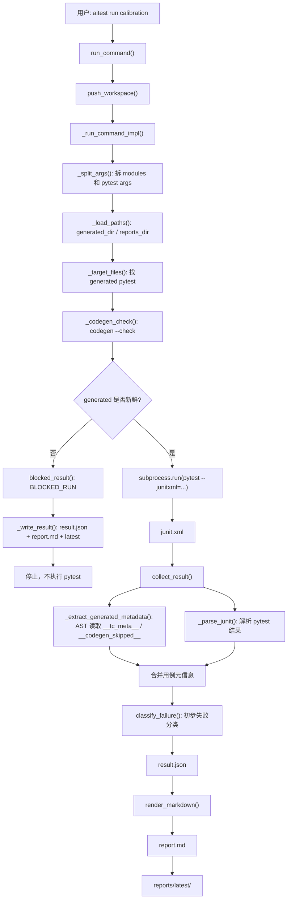

# Lesson 8：run / report 执行报告链路

> 学习目标：理解 `aitest run` 和 `aitest report` 如何把 generated pytest 的执行结果变成结构化 `result.json` 和人可读 `report.md`。

## 入口

`aitest run` 是在 `aitest_kit/cli.py` 注册进去的：

```python
from aitest_kit.report.cli import report_command, run_command

main.add_command(run_command)
main.add_command(report_command)
```

所以用户敲：

```bash
aitest run calibration
```

最终进入的是：

```python
run_command(...)
```

位置在：

```text
aitest_kit/report/cli.py
```

它和 `codegen` 一样支持：

```python
with push_workspace(workspace):
    _run_command_impl(...)
```

所以 `--workspace` 的意义仍然是：临时切换到目标 AITest workspace 里执行，结束后切回来。

## 失败分类

失败分类在 `aitest_kit/report/classifier.py`。

规则是 MVP 版本，核心逻辑：

```python
if phase == "teardown":
    return "TEARDOWN_ERROR"

if phase == "setup":
    if exception_type in ENVIRONMENT_EXCEPTIONS:
        return "ENVIRONMENT_ERROR"
    return "FIXTURE_ERROR"

if phase == "call":
    if exception_type == "AssertionError":
        return "ASSERTION_FAILURE"
    if exception_type in CODEGEN_EXCEPTIONS:
        return "CODEGEN_ERROR"
    return "UNKNOWN"
```

也就是说：

```text
setup 阶段连接失败 -> ENVIRONMENT_ERROR
setup 阶段其他问题 -> FIXTURE_ERROR
call 阶段 AssertionError -> ASSERTION_FAILURE
call 阶段 NameError/TypeError/AttributeError/SyntaxError -> CODEGEN_ERROR
teardown 阶段 -> TEARDOWN_ERROR
其他 -> UNKNOWN
```

这不是最终真相，只是初步分流。

例如：

```text
ASSERTION_FAILURE 可能是产品 bug，也可能是用例错。
UNKNOWN 需要人工判断。
ENVIRONMENT_ERROR 通常先重启服务或检查 URL。
CODEGEN_ERROR 通常回到 profile / fixture / emitter。
```

所以 report 的定位是：

```text
帮助你分流，不替你最终判定产品 bug。
```

## result.json 的结构

`collect_result()` 最终返回的是一个 dict，大概结构：

```python
{
    "run_id": "...",
    "status": "COMPLETED",
    "timestamp": "...",
    "duration_seconds": 1.23,
    "command": "aitest run calibration",
    "project_config_version": "...",
    "manual_policy": "excluded",
    "codegen_check": {...},
    "summary": {...},
    "modules": {...},
    "cases": [...],
    "codegen_skipped_cases": [...],
}
```

几个关键点：

- `project_config_version()` 会计算 `aitest_config/project_config.yaml` 的 sha256 前 8 位。
- `summary` 是总体统计。
- `modules` 是按模块、category 聚合。
- `cases` 是每条 pytest 的执行结果。
- `codegen_skipped_cases` 是没生成 pytest 的用例。

这说明 `result.json` 是机器可读的，`report.md` 是人可读的。

## report.md 怎么生成

`aitest_kit/report/renderer.py` 只做一件事：

```python
render_markdown(result)
```

它不是重新分析 pytest，只是把 `result.json` 渲染成人看的 Markdown。

报告结构是：

```text
# 测试执行报告

基础信息：
- run_id
- status
- timestamp
- duration
- command
- Codegen Check
- Manual 策略

## 执行摘要
- passed
- failed
- error
- pytest skipped
- manual_total
- manual_executed
- manual_not_run
- codegen_skipped

## 按模块统计
- business
- boundary
- 通过率

## 失败详情
- ENVIRONMENT_ERROR
- FIXTURE_ERROR
- CODEGEN_ERROR
- ASSERTION_FAILURE
- TEARDOWN_ERROR
- UNKNOWN

## 反哺清单
- 需要修 fixture / codegen profile
- 需要人工判断
- 环境问题
- codegen skipped
```

所以 `report.md` 的价值不是单纯记录 pytest 结果，而是直接告诉测试人员下一步该往哪里分流。

## aitest report 的作用

`aitest report` 不重新跑测试。

它只是：

```text
读取已有 result.json
重新 render report.md
```

入口：

```python
report_command(...)
_report_command_impl(run_id)
```

如果指定 run_id：

```bash
aitest report 20260516-120000
```

读取：

```text
test_workspace/reports/runs/20260516-120000/result.json
```

如果不指定：

```bash
aitest report
```

读取：

```text
test_workspace/reports/latest/result.json
```

所以它适合在 renderer 改了以后重渲染报告，或者用户只想重新生成 Markdown。

## 整体图



## 本节关键结论

`aitest run/report` 可以理解成：

```text
pytest 执行器 + generated freshness gate + 测试结果结构化器 + 失败分流器。
```

它不是替代 pytest，而是给 pytest 补了三层能力：

```text
1. 执行前门禁：
   generated pytest 必须和 Markdown/profile 保持一致。

2. 用例级追踪：
   通过 __tc_meta__ 把 pytest 结果映射回 Markdown TC。

3. 反哺分流：
   把失败初步分到环境、fixture、codegen、断言、teardown、unknown。
```

这也是为什么 renderer 生成的 `__tc_meta__` 和 `__codegen_skipped__` 很重要。它们不是装饰信息，而是 report 链路的数据接口。
