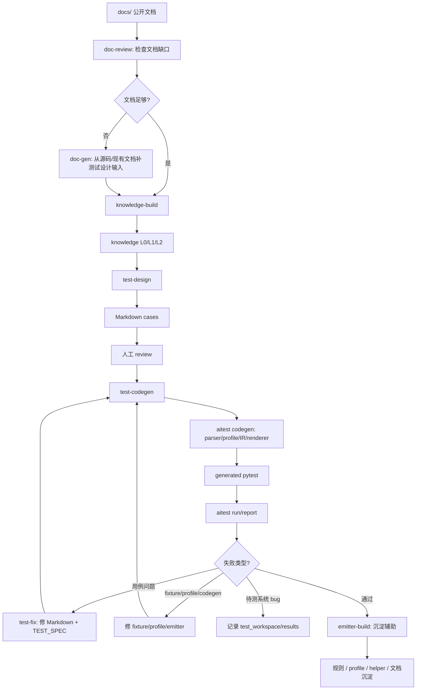

# Lesson 9：skills 工作流和 AI 协作边界

> 学习目标：理解 skill 不是替代 CLI 的代码，而是约束 AI 如何沿着测试飞轮工作的协议。

## skills 工作流总图



## 本节关键结论

skill 的本质不是自动化脚本，而是：

```text
AI 工作流协议。
```

它规定 AI 在每个阶段：

```text
读什么
不能读什么
输出什么
遇到不确定怎么标
什么时候停
什么时候进入下一阶段
什么时候沉淀经验
```

CLI 的本质是：

```text
确定性执行引擎。
```

两者合起来，才是完整项目：

```text
skills 负责让 AI 做正确的判断；
CLI 负责让稳定规则可重复执行。
```

这仍然符合项目核心哲学：

```text
AI 负责探索未知，代码负责稳定重复。
```
