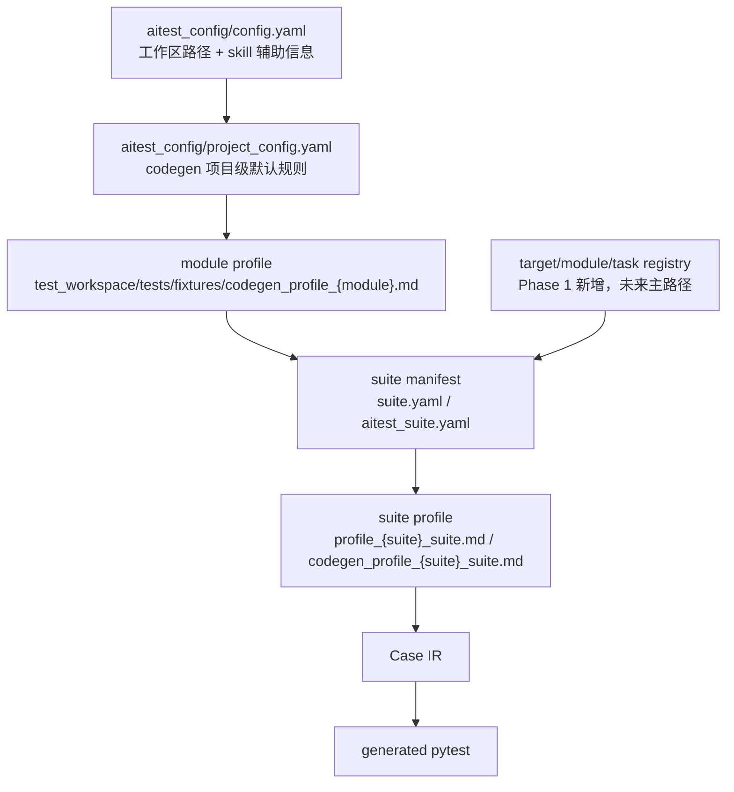

# 配置功能盘点与精简建议（Phase 3-1/2）

## 目的

这份文档先回答两个问题：

1. 目前 AITest Kit 里有哪些配置面，它们分别控制什么。
2. 哪些配置存在重复、历史兼容或可以后续精简。

本阶段只做盘点和建议，不改变现有配置语义。

## 总览

当前配置可以分成六层：



当前实际状态是：`config.yaml` + `project_config.yaml` + module profile 是稳定主路径；suite manifest / suite profile 已可用；target/module/task registry 已有 loader，但只完成第一阶段接入，尚未替代 legacy module/all 路径。

## `aitest_config/config.yaml`

### `paths`

| 字段 | 当前用途 | 代码消费点 | 结论 |
|---|---|---|---|
| `knowledge_dir` | 测试知识库根目录 | 主要被 skill / 文档使用 | 保留，但属于设计阶段配置，不是 codegen 核心运行配置 |
| `test_spec` | 测试规范文件 | `test-design`、`test-fix` 等 skill 使用 | 保留，属于 skill 行为准则 |
| `l0_architecture` | L0 架构索引 | `test-design` 等 skill 使用 | 保留，但未来可被 target/module `knowledge_refs` 替代 |
| `cases_dir` | legacy module 用例目录 | `codegen --all` / `codegen <module>` | 兼容保留；未来不应作为唯一用例入口 |
| `generated_dir` | generated pytest 输出目录 | `codegen`、`run/report` | 保留，未来可下沉到 target defaults |
| `fixtures_dir` | fixture + module profile 目录 | `codegen`、`run/report`、doctor | 保留，未来可下沉到 target defaults |
| `reports_dir` | run/report 输出目录 | `run/report`、codegen health/report | 保留，未来可下沉到 target defaults |
| `project_config` | 项目级 codegen 配置路径 | `codegen`、doctor | 保留 |
| `old_cases_dir` | 历史旧用例目录 | 主要被 `test-design` / `test-fix` 使用 | 可选保留，属于迁移辅助配置 |
| `docs_dir` | 开发文档输入目录 | 主要被 skill 使用 | 保留，属于设计阶段配置 |
| `refs_dir` | 共享引用文档目录 | 主要被 skill 使用 | 保留，属于 skill 配置 |
| `results_dir` | bug/结果记录目录 | 新项目模板有，当前主配置缺 | 建议补齐为文档/skill 配置，不影响 codegen |

### `service`

| 字段 | 当前用途 | 结论 |
|---|---|---|
| `language` / `frameworks` | 给 doc-gen、test-scaffold 这类 skill 判断技术栈 | 属于 skill 辅助信息，不是 codegen 运行核心 |
| `endpoints.http_base_url` / `grpc_target` | 描述默认服务地址 | 当前 generated pytest 主要通过 fixture/env 取地址，不应依赖这里作为真实运行凭据 |
| `route_patterns` / `schema_patterns` | 读源码或接口定义时的搜索提示 | 属于 skill 辅助信息 |

建议：后续如果进入 target 化配置，这些字段更适合放到 `target.yaml`，因为它们描述的是某个被测系统，而不是整个 AITest 项目。

### `data`

| 字段 | 当前用途 | 结论 |
|---|---|---|
| `stores` | 给测试设计/脚手架提示 Redis、DB 等测试数据构造方式 | 属于 skill 辅助信息；不应由 codegen 直接执行 |

建议：保留为 target/module 级元数据，避免全局配置假设所有模块都共用一套 Redis/DB。

### `protocols`

| 字段 | 当前用途 | 结论 |
|---|---|---|
| `primary` / `secondary` | 文档和 skill 提示 | 可保留为 skill 辅助信息 |
| `grpc_identifier` | Markdown 场景变量里识别 gRPC 的提示 | 当前 planner 实际用硬编码逻辑识别“协议/protocol + gRPC”，没有直接读取该字段 |

建议：如果保留，应明确它是写用例/skill 的提示；如果希望 codegen 读取，需要单独实现，不能假设已经生效。

### `known_limitations`

| 字段 | 当前用途 | 结论 |
|---|---|---|
| `known_limitations` | 给 test-design/test-fix 避免设计不可执行用例 | 保留，但属于知识/skill 层，不属于 pytest 生成核心 |

## `aitest_config/project_config.yaml`

这是当前 codegen 引擎最核心的项目级配置。

| 字段 | 当前用途 | 代码消费点 | 结论 |
|---|---|---|---|
| `helper_import` | generated pytest 顶部默认 HTTP helper import | `ir_renderer.py` | legacy default_http 必需；纯 case_flow 文件可能不需要 |
| `grpc_helper_import` | generated pytest 顶部默认 gRPC helper import | `ir_renderer.py` | default_grpc 必需 |
| `api_path` | default_http 默认请求路径 | `planner.py` | 对多端点/新项目不够通用；应逐步让 fixture/case_flow 承担 |
| `helper_call` | default_http 默认调用函数 | `planner.py` | legacy default_http 必需 |
| `grpc_helper_call` | default_grpc 默认调用函数 | `planner.py` | default_grpc 必需 |
| `var_map` | Markdown 断言短变量到 Python 表达式映射 | `planner.py` | 保留；适合校准这类稳定中间变量断言 |
| `module_abbrevs` | 自动字段、函数名/用例编号辅助 | `render_utils.py`、`planner.py` | 保留；未来可下沉到 module registry |
| `named_templates` | 复杂断言模板白名单 | `render_utils.py` | 保留；属于 codegen 规则库 |
| `module_types` | 定义模块类型及必需能力 | `profile_validator.py`、`emitter.py` | 保留；但应和 module registry 对齐 |
| `modules` | 模块注册表，声明 module_type 和 notes | `profile_validator.py` | 当前与 profile 的 `module_type` 重叠，需精简 |
| `default_request.auto_fields` | default_http/default_grpc 自动补请求字段 | `planner.py` | 当前 coupon_system 兼容字段；新项目默认应为空 |
| `builtin_assertion_rules` | 项目级默认断言规则 | `render_utils.py` | 保留；跨模块稳定规则沉淀点 |

### 重要现状：`modules` 与 profile `module_type` 有职责重叠

当前 validator 会按这个顺序决定 module_type：

```text
profile.module_type
  -> project_config.modules[module].module_type
```

Phase 3-3 已先修正 validator 与 emitter 的读取分裂：两者现在都通过统一 resolver 解析 `module_type`，兼容期顺序为：

```text
legacy module profile.module_type
  -> legacy project_config.modules[module].module_type
  -> missing
```

这一步只统一 legacy 读取入口，尚未接入 `module.yaml` 作为事实来源。后续目标方案仍是：

1. module registry 是事实来源，profile 可省略。
2. module profile 是 legacy 事实来源，`project_config.modules` 只保留历史兼容。
3. validator、emitter、后续 runner 都统一调用同一个解析函数，避免读取分裂。

## module profile

路径：`test_workspace/tests/fixtures/codegen_profile_{module}.md`

profile 的 YAML 块是模块级 codegen 规则。当前 schema 支持这些字段：

| 字段 | 当前用途 | 结论 |
|---|---|---|
| `module_type` | 声明模块类型，用于 gate / emitter 校验 | 保留，但事实来源需统一 |
| `assertion_rules` | 模块级断言规则，优先级高于 project_config | 保留，适合模块特有稳定断言 |
| `request_overrides` | default_http/default_grpc 的 case 级请求覆盖 | 保留，但只适合默认请求路径 |
| `extra_imports` | generated pytest 额外 import | 保留 |
| `case_fixtures` | case_body 的 fixture 参数覆盖 | 兼容保留 |
| `case_bodies` | 复杂 pytest body 逃生通道 | 保留，但不作为默认路线 |
| `case_flows` | 结构化调用/赋值/断言流程 | 保留，是当前主要沉淀形态 |
| `default_fixture` | case_flow 默认 fixture | 保留，减少重复 |
| `default_object` | case_flow 默认对象名 | 保留 |
| `default_case_setup` | case_flow 每 case 默认 setup 调用 | 保留，适合 factory fixture |
| `variables.defaults` | profile 级运行变量默认来源 | 保留 |
| `variables.cases` | case 级运行变量来源覆盖 | 保留，适合不同账号/token/key |
| `profile_scope` / `parent_module` / `suite` | suite profile 身份校验 | 保留兼容，但未来可由 suite manifest 作为事实来源 |
| `parent_profile` | schema 允许，目前核心代码不依赖 | 建议标为低优先级兼容字段 |
| `knowledge_refs` | schema 允许，但 codegen 核心不使用 | 建议迁到 target/module/suite manifest |

### 当前仓库 profile 字段使用统计

基于 `test_workspace/tests/fixtures/codegen_profile_*.md` 的 YAML 块统计：

| 字段 | 出现 profile 数 | 条目数 | 说明 |
|---|---:|---:|---|
| `case_flows` | 6 | 115 | 当前最主要的结构化生成方式 |
| `request_overrides` | 4 | 40 | legacy default_http 仍在用 |
| `assertion_rules` | 4 | 30 | 模块级稳定断言规则 |
| `case_bodies` | 3 | 24 | 复杂流程逃生通道 |
| `extra_imports` | 4 | 12 | fixture/helper 接线 |
| `case_fixtures` | 1 | 13 | 主要服务于 case_body |
| `module_type` | 2 | 0 | 多数模块依赖 `project_config.modules` 或没有强校验 |
| `default_fixture/default_object/default_case_setup` | 1 | 3 | 新增的 flow 默认能力，值得推广 |

结论：`case_flows` 已经是主流；`case_bodies` 仍有价值但数量明显少于 flow；`request_overrides` 是 default_http 兼容路线，后续新项目不应过度依赖。

## suite manifest

当前兼容两个文件名：

- 推荐：`suite.yaml`
- 兼容：`aitest_suite.yaml`

字段：

| 字段 | 当前用途 | 结论 |
|---|---|---|
| `target` | registry loader 需要；legacy suite codegen 暂不强制 | 未来保留，支持独立测试项目 |
| `module` | 指定用例归属的 L1 module | 必需 |
| `suite` | 指定本批用例名称 | 必需 |
| `case_files` | 指定本 suite 包含哪些 Markdown 用例文件 | 必需；相对路径按 manifest 所在目录解析 |
| `profile` | 指定 suite profile 文件 | 可省略；默认推断 profile 文件名 |
| `knowledge_refs` | 记录 L2/L1 等知识来源 | 当前 codegen 不执行读取；skill/review 使用 |

当前 legacy suite pipeline 还允许不写 manifest，用目录名推断 suite，并扫描目录里的 Markdown；但这会削弱解耦性。后续主路径应要求 `suite.yaml` 显式声明。

## suite profile

推荐命名：`profile_{suite}_suite.md`

兼容命名：`codegen_profile_{suite}_suite.md`

当前 suite profile 与 module profile 使用同一套 schema，但语义不同：

- module profile：稳定能力，跟 module/fixture 走。
- suite profile：本批用例的 case_flows / case_bodies / variables / request_overrides，跟用例走。

当前合并规则：

| 字段 | 合并规则 |
|---|---|
| `module_type` | 只从 module profile 继承 |
| `assertion_rules` | 只从 module profile 继承 |
| `default_fixture/default_object/default_case_setup` | suite 优先，否则 module |
| `extra_imports` | module + suite 去重合并 |
| `request_overrides/case_fixtures/case_bodies/case_flows` | module + suite 合并；case_id 重复时报冲突 |
| `variables` | defaults 合并，case 覆盖合并 |

这个设计方向是对的：module profile 负责稳定动作库接线，suite profile 负责具体用例怎么拼动作。

## target/module/task registry（Phase 1 新增）

registry 现在已经有 loader 和数据模型，但还没有完全替代 legacy 路径。

### target config

推荐路径：`test_workspace/targets/{target}/target.yaml`

也支持集中配置：`aitest_config/targets.yaml`

字段：

| 字段 | 当前用途 | 结论 |
|---|---|---|
| `target` | 被测系统 ID | 保留 |
| `source_root` | 被测源码或项目根路径 | skill/doc-gen 使用，codegen 不直接依赖 |
| `docs` | 公开文档/API 文档路径 | skill 使用 |
| `defaults.module_dir` | module registry 默认目录 | 保留 |
| `defaults.fixture_dir` | target 下 fixture 默认目录 | 保留 |
| `defaults.helper_dir` | target 下 helper 默认目录 | 保留 |
| `defaults.profile_dir` | target 下 module profile 默认目录 | 保留 |
| `defaults.suite_dir` | target 下 suite 默认目录 | 保留 |
| `defaults.generated_dir` | target 下 generated 默认目录 | 保留 |
| `defaults.reports_dir` | target 下 reports 默认目录 | 保留 |
| `knowledge_refs` | target 级知识引用 | 保留 |

### module registry

推荐路径：`test_workspace/targets/{target}/modules/{module}.yaml`

字段：

| 字段 | 当前用途 | 结论 |
|---|---|---|
| `target` | 防止 module 误挂到别的 target | 保留 |
| `module` | L1 module 名 | 保留 |
| `knowledge_refs.l1` | 模块知识文档 | 保留 |
| `fixture.file` | 模块 fixture 文件 | 保留 |
| `fixture.default_fixture` | 默认 pytest fixture 函数名 | 保留 |
| `profile.file` | module profile 文件 | 保留 |
| `helpers` | 关联 helper 文件 | 保留 |
| `registered_suites` | module 下已注册 suite | 保留；后续 `all` 应基于它，而不是目录扫描 |

### task manifest

推荐路径：`test_workspace/tasks/{task}.yaml`

字段：

| 字段 | 当前用途 | 结论 |
|---|---|---|
| `task` | 任务名 | 保留 |
| `units[].target` | 本执行单元所属 target | 保留 |
| `units[].module` | 本执行单元所属 module，可用于校验/覆盖 | 保留 |
| `units[].suite` | 本执行单元 suite 名，可用于展示/校验 | 保留 |
| `units[].suite_file` | 直接指定 suite manifest | Phase 2 已支持 |
| `units[].case_ids` | 只跑部分 case | `run --task` 已用 `-k` 粗略支持，codegen 还未做单 case 生成 |
| `units[].all` | 跑 target 的全部 active suite | 已建模，CLI 暂未实现 |

## 主要重复与精简建议

### 1. `config.yaml.paths` 与 target defaults 重复

当前全局路径适合单项目 workspace；target defaults 更适合多 target 独立测试项目。

建议分阶段：

1. 保留 `config.yaml.paths` 作为 legacy/default。
2. 新 target 模式优先读取 target defaults。
3. `codegen --all` 改成 registry-driven all 后，再弱化 `cases_dir` 的中心地位。

### 2. `service/data/protocols/known_limitations` 与 target/module 元数据重复

这些字段描述的是被测系统或模块，不是 AITest 框架本身。

建议：

- 单 target 模板中继续保留，方便新用户。
- 多 target 架构中迁入 `target.yaml` 或 module registry。
- codegen 不直接依赖这些字段；skill 可以继续读取。

### 3. `project_config.modules` 与 profile `module_type` 重复

这是当前最需要梳理的重复点。

建议最终选择一种主来源：

- 推荐：module registry 记录 module_type，validator/emitter 都通过同一个 resolver 读取。
- 兼容期：profile `module_type` 优先，其次 module registry，其次 `project_config.modules`。
- 之后：`project_config.modules` 变成 legacy，或者只保留内置示例，不再作为新项目主配置。

### 4. `api_path/helper_call/request_overrides` 与 case_flow 路线重叠

default_http 路线适合单接口、结构稳定的模块。

多端点、新项目、带登录/资源状态的接口，更适合：

```text
fixture/client 动作库
  + suite profile case_flows
  + variables
```

建议：

- 保留 default_http 作为低成本入口。
- 新项目 scaffold 默认优先生成 fixture client + case_flow。
- 不再强化 `api_path` 作为全局中心配置。

### 5. profile identity 与 suite manifest 重复

suite manifest 已经有 `module` / `suite` / `profile`。suite profile 里再写：

```yaml
profile_scope: case_suite
parent_module: xxx
suite: xxx
```

主要用于防呆校验。

建议：

- 短期保留，避免 profile 放错目录还不报错。
- 长期可以允许 suite profile 省略 identity，由 suite manifest 作为事实来源。

### 6. `knowledge_refs` 不应放在太多层重复配置

建议：

- target 放 `l0` 或全局知识入口。
- module 放 `l1`。
- suite 放 `l2`。
- profile 不再承担知识引用职责。

### 7. `default_request.auto_fields` 应从全局弱化

这个配置解决了 coupon_system 历史需求，但它天然带项目假设。

建议：

- 新项目默认 `{}`。
- 需要时放到 target/module 默认配置，而不是全局 project_config。
- 对多端点模块，优先通过 fixture client 和 case_flow 显式传参数。

## 推荐的目标配置边界

已确认的方向：新架构把全局入口合并为一个文件，推荐命名为
`aitest_config/aitest.yaml`。旧的 `config.yaml` + `project_config.yaml`
继续兼容读取，但不再作为新项目的推荐心智模型。

合并后的文件不是扁平大 YAML，而是按职责分区：

```text
aitest_config/aitest.yaml
  workspace:
    paths / refs / 全局默认
  codegen:
    helper fallback
    builtin_assertion_rules
    named_templates
    module_types
  targets:
    target 入口索引或轻量声明

target.yaml
  被测系统级元数据：
    source_root/docs/service/data/default dirs/knowledge l0

modules/{module}.yaml
  module 稳定测试能力：
    knowledge l1
    fixture/helper/profile
    module_type
    registered_suites

suite.yaml
  用例批次：
    target/module/suite
    case_files
    profile
    knowledge l2

task.yaml
  执行计划：
    units: suite_file / all / case_ids
```

兼容策略：

1. 优先读取 `aitest_config/aitest.yaml`。
2. 如果不存在，则读取旧的 `aitest_config/config.yaml` 和 `aitest_config/project_config.yaml`。
3. 旧文件在一段时间内继续支持，避免破坏已有 AITest workspace。
4. 新文档、新模板、新 skill 只推荐 `aitest.yaml`。

## 需要 review 的决策点

已确认：

1. 全局配置入口合并为 `aitest_config/aitest.yaml`，旧配置兼容。
2. `module_type` 的事实来源迁到 module registry。
3. `config.yaml.service/data/protocols` 迁到 target config，单 target 模板可继续保留兼容说明。
4. module profile 从 `codegen_profile_{module}.md` 逐步改名为 `profile_{module}.md`，旧命名兼容。
5. suite profile 允许省略 `profile_scope/parent_module/suite`，由 `suite.yaml` 管身份；旧字段继续防呆兼容。
6. `all` 只遍历 `registered_suites.status=active`，不再扫描 `test_workspace/cases/*`。
7. 新 target 架构中，generated/reports 作为一级产物目录，按 target 分桶；`targets/{target}/` 只放稳定测试能力配置，不放运行产物。
8. `aitest.yaml` 只保留 workspace / codegen / targets 索引；描述被测系统的 `service/data/protocols/known_limitations` 下沉到 target。

### `aitest.yaml` 推荐边界

`aitest.yaml` 是全局入口，但不能变成新的大杂烩。它只保存整个 AITest 测试项目共享的信息：

```yaml
workspace:
  paths:
    docs_dir: docs
    refs_dir: aitest_config/refs
    generated_root: test_workspace/generated
    reports_root: test_workspace/reports
    results_dir: test_workspace/results

codegen:
  helper_import: "from test_workspace.tests.helpers import http as http_helper"
  grpc_helper_import: "from test_workspace.tests.helpers import grpc_ops"
  helper_call: "http_helper.post"
  grpc_helper_call: "grpc_ops.call"
  module_types: {}
  named_templates: []
  builtin_assertion_rules: []

targets:
  sub2api:
    config: test_workspace/targets/sub2api/target.yaml
```

以下内容不再推荐放全局：

```yaml
service: {}
data: {}
protocols: {}
known_limitations: []
```

原因是它们描述的是某个被测系统，而不是整个 AITest 测试项目。测试项目同时接入多个 target 时，这些字段如果放全局会出现冲突。

待继续讨论：

1. module/suite/task 三级配置里，哪些字段是必填，哪些字段是可选。
2. 旧配置到新配置的迁移命令是否需要提供自动转换。

### `target.yaml` 已确认边界

`target.yaml` 只回答“这个被测系统是什么，以及它的测试资产默认放哪”。

最小可用配置：

```yaml
target: sub2api
docs:
  - docs/public_api_doc.md
```

或：

```yaml
target: sub2api
source_root: /Users/zmw/DragonCode-sub2api
```

规则：

- `target` 必填。
- `source_root` 和 `docs` 至少一个要有。
- `knowledge_refs.l0`、`service`、`data`、`protocols`、`known_limitations` 都可选。
- `defaults` 全部可选，由代码按 target 推导。

默认推导：

```text
module_dir    = test_workspace/targets/{target}/modules
fixture_dir   = test_workspace/targets/{target}/fixtures
helper_dir    = test_workspace/targets/{target}/helpers
profile_dir   = test_workspace/targets/{target}/profiles
suite_dir     = test_workspace/suites/{target}
generated_dir = test_workspace/generated/{target}
reports_dir   = test_workspace/reports/{target}
```

不放在 target.yaml：

```text
module_type / fixture / profile / registered_suites / case_files / case_ids
```

### `module.yaml` 已确认边界

`module.yaml` 只回答“这个模块怎么接入测试生成链路”。

最小配置：

```yaml
module: gateway_api
```

推荐配置：

```yaml
target: sub2api
module: gateway_api
module_type: multi_endpoint

knowledge_refs:
  l1: test_workspace/knowledge/L1/gateway_api.md

fixture:
  file: gateway_api.py
  default_fixture: setup_gateway_api

profile:
  file: profile_gateway_api.md

helpers:
  - http.py

registered_suites:
  - suite: quota_billing_v2
    manifest: test_workspace/suites/sub2api/quota_billing_v2/suite.yaml
    status: active
```

规则：

- `module` 必填。
- `target` 可选；标准路径下可推导。
- `module_type` 可选；目标架构默认 `standard_http`，当前第一版只消费显式声明值，未声明时保留 legacy profile / project_config 兼容。
- `knowledge_refs.l1` 强烈建议写，但不强制。
- `fixture/profile/helpers/registered_suites` 可省略。

`module_type` 事实来源：

```text
新架构：
  module.yaml.module_type
    -> default: standard_http

旧兼容：
  仅当 module.yaml 不存在时，才读取：
    legacy module profile.module_type
      -> legacy project_config.modules[module].module_type
      -> default: standard_http
```

当前第一版已经接入 `module.yaml.module_type`：target-aware suite codegen 会把该字段注入运行时 profile，使 validator / emitter 走同一条 `module_type` 校验路径。未声明 `module_type` 的 module registry 仍不强行默认，避免当前项目的 `standard_recommend` 与新模板 `standard_http` 在兼容期产生误判。

默认推导：

```text
fixture.file            = {target.defaults.fixture_dir}/{module}.py
fixture.default_fixture = setup_{module}
profile.file            = {target.defaults.profile_dir}/profile_{module}.md
```

旧 profile 命名兼容：

```text
优先读取 profile_{module}.md
如果不存在，再读取 codegen_profile_{module}.md
```

不放在 module.yaml：

```text
case_files / case_ids / request_overrides / case_flows / case_bodies / variables.cases
```

### `suite.yaml` 已确认边界

`suite.yaml` 只回答“这一批用例属于哪个 target/module，以及包含哪些 Markdown 用例文件”。

推荐配置：

```yaml
target: sub2api
module: gateway_api
suite: quota_billing_v2

case_files:
  - quota_billing_business.md
  - quota_billing_boundary.md

profile: profile_quota_billing_v2_suite.md

knowledge_refs:
  l2:
    - test_workspace/knowledge/L2/quota_billing_v2.md
```

规则：

- `target/module/suite/case_files` 必填。
- `case_files` 相对 `suite.yaml` 所在目录解析，外部用例可写绝对路径。
- `profile` 可选，默认优先 `profile_{suite}_suite.md`，再兼容 `codegen_profile_{suite}_suite.md`。
- `knowledge_refs.l2` 可选，建议写。
- `suite.yaml` 不放 fixture/helper/module_type，不放 case_flows/case_bodies/request_overrides/variables，不放 case_ids/include_manual/pytest_args/env_file/allow_risk。
- `suite.yaml` 走新严格规则；`aitest_suite.yaml` 继续 legacy 兼容。

### `task.yaml` 已确认边界

`task.yaml` 只回答“这一次要跑哪些测试单元，以及用什么执行参数跑”。

推荐配置：

```yaml
task: sub2api_regression
description: Sub2API 回归任务

env_files:
  - /tmp/sub2api-test.env

defaults:
  include_manual: false
  pytest_args:
    - -q
  allow_risk: []

units:
  - name: quota_billing_v2
    suite_file: ../suites/sub2api/quota_billing_v2/suite.yaml

  - name: gateway_debug
    suite_file: ../suites/sub2api/gateway_smoke/suite.yaml
    case_ids:
      - TC-GW-001

  - name: sub2api_all
    target: sub2api
    all: true
```

规则：

- `task/units` 必填。
- unit 必须二选一：`suite_file`，或 `target + all: true`。
- 当前实现 `suite_file`、`env_files`、`defaults.include_manual`、`defaults.pytest_args`、`case_ids`。
- `allow_risk` 先只解析保留，不执行风险门禁。
- `target + all: true` 暂不实现，等待 registry-driven all。
- `env_files` 相对 `task.yaml` 所在目录解析，运行报告只记录文件路径和变量名，不记录变量值。
- `case_ids/include_manual/pytest_args` 属于 task，不属于 suite。
- `task.yaml` 不放 module_type、fixture/profile/helper、case_files/knowledge_refs、case_flows/case_bodies/request_overrides/variables。

## 下一步建议

Phase 3-3 已完成第一刀：

- 增加 `aitest_kit/codegen/module_type.py`。
- validator / emitter 共享 `resolve_module_type()` 和 `validate_module_type_requirements()`。
- 补充回归测试，覆盖 profile 不声明 `module_type` 但 legacy `project_config.modules` 声明 `module_type` 的 emitter 行为。

Phase 3-3 已完成第二刀：

- module profile 新命名 `profile_{module}.md` 接入为优先路径。
- 旧命名 `codegen_profile_{module}.md` 继续兼容。
- module codegen、profile gate、suite runtime profile、health/promotion/explain 统一通过同一路径解析函数读取 module profile。
- suite 目录扫描和 doctor 也识别 `profile_*_suite.md`。
- 验证：全量单测通过，legacy `codegen --all --validate-profile`、`codegen --all --check`、`doctor` 均通过。

Phase 3-3 已完成第三刀：

- `suite` generated 文件名格式仍是 `test_{module}_{suite}_{case_file_stem}.py`。
- 由 `aitest_kit.codegen.suite` 暴露统一函数。
- suite runner 和 report/run 不再各自拼接。
- 不迁移 generated 目录，不改变文件名格式。

Phase 3-3 已完成第四刀：

- `module.yaml.module_type` 已进入 registry loader。
- target-aware suite codegen 会将 `module.yaml.module_type` 注入 runtime profile。
- `doctor` 增加 target registry 检查，覆盖 target/module/fixture/profile/registered suite/case file/suite profile 的基础接线。
- 当前 coupon_system/calibration 试点已在 `module.yaml` 声明 `module_type: standard_recommend`。
- 未声明 `module_type` 时继续走 legacy profile / project_config 兼容，后续统一到 `aitest.yaml` 后再决定是否强制默认 `standard_http`。

Phase 3-3 已完成第五刀：

- 新增统一配置读取模块 `aitest_kit.workspace_config`。
- `codegen` / `run` / `report` / `doctor` 的 workspace 路径读取统一走该模块。
- `load_project_config()` 已支持优先读取 `aitest_config/aitest.yaml` 的 `codegen` section。
- 旧 `aitest_config/config.yaml` + `aitest_config/project_config.yaml` 继续兼容。
- 当前不改模板、不迁移真实配置文件，只先建立兼容读取能力。

Phase 4 已完成第一刀：

- suite manifest 声明 `target` 且 target registry 存在时，suite codegen/run 使用 target defaults：
  - `profile_dir`
  - `generated_dir`
  - `reports_dir`
- target registry 不存在时，完全回退 legacy 路径。
- 已覆盖新结构下：
  - 从 `test_workspace/targets/{target}/profiles/profile_{module}.md` 读取 module profile。
  - 生成 pytest 到 `test_workspace/generated/{target}/`。
  - 从 `test_workspace/generated/{target}/` 执行 pytest。
  - 报告写入 `test_workspace/reports/{target}/`。

Phase 4 已完成第二刀：

- 不移动现有文件。
- `aitest init` 模板新增：
  - `test_workspace/targets/`
  - `test_workspace/suites/`
  - `test_workspace/generated/`
- legacy 目录继续保留兼容：
  - `test_workspace/cases/`
  - `test_workspace/casesuites/`
  - `test_workspace/tests/fixtures/`
  - `test_workspace/tests/generated/`
- `aitest upgrade --check` 新增只读布局建议：
  - 发现 legacy fixture/profile 资产时，建议迁移到 `test_workspace/targets/{target}/`。
  - 发现 legacy generated pytest 时，建议迁移到 `test_workspace/generated/{target}/`。
  - 发现 legacy casesuite 资产时，建议迁移到 `test_workspace/suites/{target}/{suite}/`。
- `aitest upgrade --apply` 不自动移动这些目录，只继续同步模板托管文件。

下一步建议进入 Phase 4 第三刀：

1. 用临时 workspace 验证 `init -> upgrade --check -> doctor`。
2. 在 coupon suite 上验证 target-aware generated/report 路径。
3. 再决定是否实际迁移本仓示例资产，或继续保持 legacy 兼容。

Phase 4 已完成第三刀：

- 新增真实 coupon 试点：
  - target: `coupon_system`
  - module: `calibration`
  - suite: `calibration_smoke`
- suite 用例不复制，直接引用现有 `test_workspace/cases/calibration/business.md`。
- target profile 目录已生效：
  - `test_workspace/targets/coupon_system/profiles/profile_calibration.md`
- generated 新目录已生效：
  - `test_workspace/generated/coupon_system/test_calibration_calibration_smoke_business.py`
- reports 新目录已生效：
  - `test_workspace/reports/coupon_system/`
- `run --suite-file` freshness check 已修复为调用 `codegen --suite-file ... --check`。
- fixture discovery 已解决第一版：
  - suite target 存在 `module.yaml` 时，codegen 根据 `fixture.file/default_fixture` 自动注入 fixture import。
  - generated pytest 不再必须依赖 `conftest.py` 的 `pytest_plugins` 静态注册。
  - `coupon_system` 试点已生成 target fixture import。
  - target helper import 已接入：当 `target.yaml.defaults.helper_dir` 下存在 `http.py` 或 `grpc_ops.py` 时，suite generated pytest 优先导入 target helper。
  - 当前 target fixture/helper 文件先作为 bridge 重新导出现有 legacy 资产，后续可以替换成完整 target-local 实现。

下一步建议：

1. 暂不迁移全仓示例资产，继续保留 legacy 兼容。
2. 讨论是否把更多 coupon bridge fixture/helper 替换为 target-local 实现。
3. 或进入 Phase 5，先更新 skills，让 AI 后续优先生成 target/suite 新结构。
